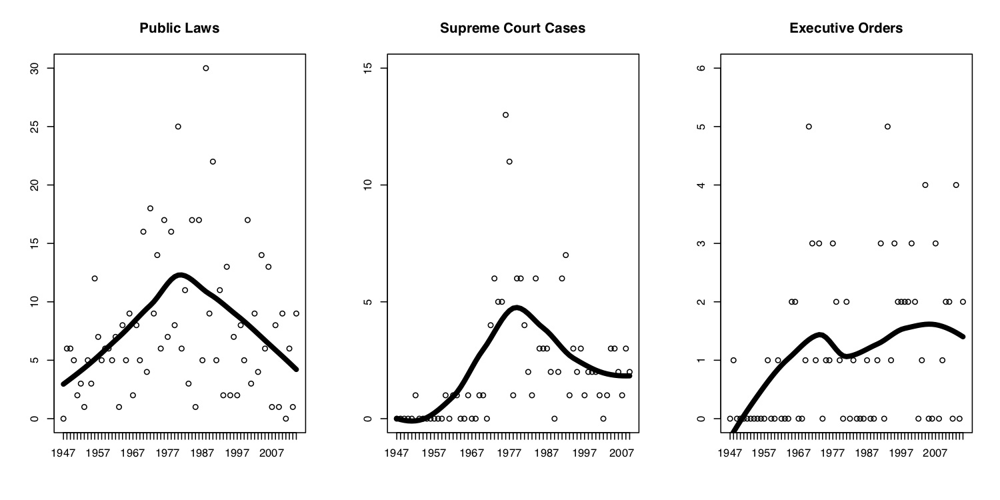

  
```{r setup, include=FALSE}
knitr::opts_chunk$set(warning = FALSE, message = FALSE, 
                      fig.retina = 3, fig.align = "center")
```

```{r xaringanExtra, echo=FALSE}
xaringanExtra::use_webcam()
```

# Syllabus Overview and <br> Course Introduction

.pull-left[
<figure>
  
</figure>

]

.pull-right[

**EVSS-PUBA 534: Environmental Law and Regulatory Policy**

**Spring 2022**

.light[Matthew Nowlin, PhD<br>
Department of Political Science<br>
College of Charleston
]

]

---

class: title title-2

# COVID-19 

.pull-left[
**It's not over** 

**Get vaccinated! (including booster)**

**Masks must be worn _properly_ in class at all times** 

**If you don't feel well, don't come to class**
]

.pull-right[
</br>
<figure>
  
</figure>
]

---

name: outline
class: title title-2

# The Syllabus 

**It's on OAKS (lms.cofc.edu)** 

**Content -> Syllabus** 

**Follow the schedule** 

**But, things likely to change**

**Check OAKS** 

---

class: title title-2

# Your Professor 

.pull-left[
<figure>
  
</figure>
]

.pull-right[
- Dr. Matthew C. Nowlin 

- Email: [nowlinmc@cofc.edu](mailto:nowlinmc@cofc.edu)

- ~~Office~~ Student Hours: Use the [Calendly link](https://calendly.com/nowlinmc/meetings) on the syllabus and on OAKS under _Meet with Me_ 


]

---

class: title title-2

# What is this course about? 

**This course will provide an overview of several major topics within environmental law as well as the regulatory instruments used to address environmental problems.** 

--

* The aim of this course is for students in the MES, MPA, or concurrent MES/MPA programs to gain an understanding of the development and scope of environmental law in the US. 

--

* This course is about the **WHAT IS** of environmental law and regulatory approaches 

???
less about the how; very little about the why 

---

class: title title-2

# What is this course about? 

**The course is divided into four sections:** 

--

**Foundations**: Jan 13-Feb 3

_Includes some of the foundational aspects of environmental law including environmental risks, enforcement, key actors, sources of environmental laws, administrative law, and rulemaking_ 

---

class: title title-2

# What is this course about? 

**The course is divided into four sections:** 

**Pollution Control**: Feb 10-March 24

_Covers legal and regulatory approaches for:_ 

.pull-left[
* air pollution
* climate change
* water pollution
]
.pull-right[
* drinking water
* toxic substances 
* waste management
]

---

class: title title-2

# What is this course about? 

**The course is divided into four sections:** 

**Ecosystem Services**: March 31-April 7 

_Discusses management of natural resources and includes the public trust doctrine, wetlands, land use, biodiversity, and endangered species_

--

**Environmental Impact Statements**: April 14 

_Examines the National Environmental Policy Act (NEPA)_  

---

class: title title-2

# What is this course about?

**Learning Objectives**

-  Develop an understanding of key environmental statues 

-  Evaluate the various regulatory instruments used to address environmental problems

-  Analyze a specific environmental problem and the legal and regulatory approaches used to address it

-  Display oral, written, and group communication skills

---

class: title title-2

# Course Info 

* All required readings will be provided on [OAKS](https://lms.cofc.edu) as either a link or a pdf 

* Attendance will be taken for each class, _but don't come if you don't feel well_ 

* Have a laptop, tablet, phone, or other device to access readings and for in-class assignments 

* This course will be largely discussion-based so be prepared to discuss the readings and participate in class, _while also allowing opportunities for others to participate_ 

---

class: title title-2

# Assignments

|Assignment | Points|
| --- | --- |
|**Reflection papers (10)** | 200 points total |
|**Paper** | 150 points |
|**Presentation** | 50 points |
|**In-class assignments** | 50 points total| 
|**Engagement** | 50 points total |
|  |   |
|**Total** | **500 points**|

---

class: title title-2

# Late Work Policy 

**Really only applies to the policy brief** 

* 48-hour grace period: _can still turn in work with no late penalty_  

--

* After grace period, 10% deduction for each 24 hr period its late 

--

* After 72 hours beyond grace period, assignment will not be accepted 

---

class: title title-2

# Important Information 

**Make note of:** 

* **Honor Code and Academic Integrity** 
* **Students with Disabilities** 
* **Financial Challenges** 
* **Counseling Center** 
* **Center for Student Learning**
* **Religious Holiday Policy** 
* **Weather**

---

class: middle, center 

# Course Introduction 

---

class: middle, center 

# What is environmental law? 

---

class: title title-2 

# Environmental Law 

> **The use of public authority to _protect_ the natural environment and human health from the impacts of pollution and development** 

-Salzman and Thompson (2014), pg. 3 

--

> **Environmental law is necessarily almost as complex and dynamic as the ecosystem it seeks to protect**

-Lazarus (2004), pg. 6

???
protect involves risk assessments and analysis 
---

class: title title-2 

# Environmental Law 

**Encompasses**: 

_public lands and waters; wilderness; wildlife; pollution; ecosystem services; human health and safety; energy use; transportation; urban design and building standards; agriculture and food production; and human population growth_

--

We will cover: _air pollution, climate change, water pollution, drinking water, toxic substances, waste management, public lands, wetlands, WOTUS, and endangered species_ 

---

class: title title-2 

# Environmental Law 

**The outputs of the environmental policymaking system** 

--

Combined these outputs constitute the **green state** 

--

**Green State** 

_The thicket of federal and state statues, regulations, and court decisions regarding environmental issues_ 

* Has developed over time through policy layering 
* Shapes and constrains how environmental problems are addressed 

---

class: title title-2 

# Environmental Law 

<figure>
<center>
  
</figure>

---

class: title title-2 

# Environmental Law 

**Some of the major federal statues that we will examine** 

* The National Environmental Policy Act: 1969
* Clean Air Act: 1963, 1970, 1977, 1990 
* Clean Water Act: 1972, 1977 
* Safe Drinking Water Act: 1974 
* Toxic Substances Control Act: 1976 
* Resource Conservation and Recovery Act: 1976 
* Comprehensive Environmental Response, Compensation, and Liability Act: 1980

---

class: title title-2 

# Environmental Law 

**Environmental policy designs** 

* Policy goals 
* Causal framework 
* **Policy instruments** 
  * Which instruments? 
* Targets of the policy 
* Implementation structure 

---

class: title title-2 

# Environmental Law 

**Four analytical frameworks** 

* Environmental rights 

* Sustainable development 

* Utilitarianism and Cost-Benefit Analysis 

* Environmental justice 


---

class: title title-2 

# For Next Time 

**Environmental Risks, Law, and Enforcement** 

.small[
* _Readings_: 
	- **Lazarus**, Chapter 2: _The Implications of Ecological Injury for Environmental Protection Law_, from Lazarus, Richard J. 2004. _The Making of Environmental Law_. Chicago, IL: University of Chicago Press.
	- Shaffer, Rachel M. 2021. “Environmental Health Risk Assessment in the Federal Government: A Visual Overview and a Renewed Call for Coordination.” _Environmental Science & Technology_ 55(16): 10923–27.
	- **Salzman and Thompson**, Chapter 2, pgs. 31-49: _Four Analytical Frameworks_ 
	- **Salzman and Thompson**, Chapter 4: _Enforcement_, from Salzman, James, and Barton H. Thompson Jr. 2014. _Environmental Law and Policy_. 4th ed. St. Paul, MN: Foundation Press.
]


