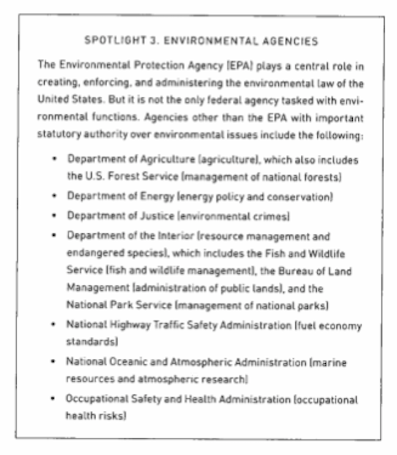

  
```{r setup, include=FALSE}
knitr::opts_chunk$set(warning = FALSE, message = FALSE, 
                      fig.retina = 3, fig.align = "center")
```

```{r xaringanExtra, echo=FALSE}
xaringanExtra::use_webcam()
```

# Actors, Administrative Law, and the Environment

.pull-left[
<figure>
  
</figure>

]

.pull-right[

**EVSS-PUBA 534: Environmental Law and Regulatory Policy**

**Spring 2022**

.light[Matthew Nowlin, PhD<br>
Department of Political Science<br>
College of Charleston
]

]

---

class: title title-2 

# Overview 

**Key actors** 
.small[
* Structure and function of government
]

**Sources of environmental laws** 
.small[
* Constitution 
* Common law 
* Statues 
* Regulations 
* Executive orders 
]

**Administrative law** 


---

class: middle 

# Key (federal, state, and local) actors

---

class: title title-2

# Federalism 

**Mismatched scales** 

* Environmental impacts are often _diffuse_, where the consequences are geographically and spatially distant from the causes 

* Mismatched political and natural boundaries 
  * Who should make environmental law, national or local authorities? 

---

class: title title-2

# Federalism 

**Jurisdiction** 
* _Exclusive_
* _Concurrent_ 

--

**Preemption**: 
* _The higher authority of law displaces the lower authority of law_  

--
* **Supremacy Clause**

---

class: title title-2

# Federal Government 

**Enumerated Powers** 
* Powers granted to the federal government in Article I, Section 8 of the Constitution

--

**Environmental law and enumerated powers** 
* **Commerce Clause** 

--
* **Property Clause** 

--
* **Treaty power** 

???
**Property Clause**: Congress shall have Power to dispose of and make all needful Rules and Regulations respecting the Territory or other Property belonging to the United States
---

class: title title-2

# Indigenous Peoples 

**Tribal governments** 
* Distinct political bodies 

--
* US government can limit sovereignty 

--
* **Trust Doctrine**: federal government supports tribal self-government and economic prosperity 

--

**Trust Doctrine extends to environmental protections** 
.tiny[
* _United States v. Mitchell_ (1983)
* _U.S. v. White Mountain Apache Tribe_ (2003)
* _United States v. Navajo Nation_ (2009)
]


---

class: title title-2

# Indigenous Peoples 

**Enforcement of environmental laws on tribal lands**

.small[
_We analyze enforcement of and compliance with the Clean Water Act (CWA) and Safe Drinking Water Act (SDWA) to compare the implementation of environmental policy on tribal lands with nontribal facilities. **Analysis reveals that, compared with nontribal facilities, tribal facilities experience less rigorous CWA and SDWA enforcement and are more likely to violate these laws**._]

.tiny[Teodoro, Manuel P., Mellie Haider, and David Switzer. 2018. “U.S. Environmental Policy Implementation on Tribal Lands: Trust, Neglect, and Justice.” _Policy Studies Journal_ 46(1): 37–59.
]


---

class: title title-2

# Functional Separation 

<figure>
<center>
  
</figure>

---


class: title title-2

# Separation of Power 

| Congress | President | Courts 
--- | --- | --- | --- 
**Legislative** | **make laws** | recommend laws, veto, regulations | review laws  
**Executive** | override vetos, oversight | **enforce and implement laws** | review executive acts 
**Judicial** | advise and consent | pardon, nominate judges | **interpret laws** 

---

class: middle 

##  Briefly describe the role of administrative agencies in environmental law and the relationships between administrative agencies and the other branches of government 

---

class: title title-2

# Executive Branch Agencies 

<figure>
<center>
  
</figure>

---

class: title title-2

# Executive Branch Agencies 

.pull-left[
<figure>
<center>
  
</figure>
]

--

.pull-right[
<figure>
<center>
  
</figure>
]

---

class: middle 

# Sources of environmental law 

---

> **Environmental law, as now defined, is primarily a synthesis of
pre-environmental era common law rules, principles from other
areas of law, and post-environmental era statutes which are lightly
influenced by the application of concepts derived from ecology and
other areas of science, economics, and ethics.** 

.small[-Tarlock, A. Dan. 2003. “Is There a There There in Environmental Law?” _Journal of Land Use & Environmental Law_ 19(2): 213–54, pg. 222]

---

class: title title-2

# Constitutional Law

.pull-left[
* Provides for the structure and function of government

* Includes _limits on government_ and _protection of individual rights_ 
]

.pull-right[
<figure>
<center>
  
</figure>
]

---

class: title title-2

# Common Law

* No comprehensive, codified set of rules 

--

* Open to judicial interpretation 

--

* Precedent; _stare decisis_ 
  * Case law
  
--

* Private: contract law, property law, and **tort doctrines**  

--

* Public: constitutional law, **administrative law**, criminal law 

---

class: title title-2

# Tort Doctrines 

**Tort law**: _the law of civil wrongs, which allows individuals to sue other individuals who have harmed them_ 

--

**Negligence** 
* _The failure to satisfy a standard of reasonable care while performing acts that foreseeably harm other people_  

--

**Trespass**
* _The intentional interference with the property interest of a property owner_ 

???
**Negligence**: spill that leads to contamination; liability for costs of clean-up and damages 

**Trespass**: dumping trash on someone else's property 
---

class: title title-2

# Tort Doctrines 

**Nuisance** 
* _The substantial and unreasonable interference with a property right_ 

--

* **Private nuisance** 
  * Focus on invasions of interests in the _private_ use and enjoyment of land 
  * Remedy: injunction or damages 

---

class: title title-2

# Tort Doctrines 

* **Public nuisance** 
  * Involves offenses against the state arising from actions that interfere with public property or that endangered the health or property of large numbers of people 
  * Remedy: injunction 

--

**Product liability** 
* _Someone manufactures and/or distributes a product that causes harm to a person or property_ 
* _Strict_ liability: not foreseeable and no intent to harm 

---

class: title title-2

# Property Law 

_Governs the legal relationship between people and things, [and] is particularly relevant to environmental quality through its impact on land use and on people's use of natural resources_ 

--

* **Takings Clause** 
  * Regulatory takings 

--
* **Zoning** 

--
* **Conservation easements**: _voluntary legal agreements between landowners and a trust or government agency, which permanently limit use of land to protect its conservation value_ 

---

class: title title-2

# Statutes

**How does a bill become a law?**  

.pull-left[
<center>
<figure>
  
</figure>
]


.pull-right[
<figure>
  
</figure>
]

---

class: title title-2

# Regulations 

<figure>
<center>
  
</figure>

---

class: title title-2

# Executive Orders 

_Written directions from the president that are legally binding so long as they fall within the president's constitutional authority_ 

* Have the force of law, but can be reversed or significantly changed by a subsequent president 

---

class: middle 

# Administrative law 

---

class: title title-2

# Administrative Law 

_Regulates how public administrative agencies do what they do and why, as well as their authority to do it_ 

--

* Procedures agencies use 

--
* Control the exercise of agency authority 

--
* Transparency and review 


--

_...it is broadly concerned with the role and power relationships of administrative agencies in society or, simply, the ways in which administrative agencies use their power in implementing public policies_ (Warren, 2010, pg. 17)

---

class: title title-2

# Administrative Law 

<figure>
<center>
  
</figure>

???
systems approach / model 

---

class: title title-2

# Administrative Law 

**Administrative agencies perform all three government functions** 
* (Quasi)-Legislative: rulemaking 
* Executive: execute laws 
* (Quasi)-Judicial: administrative hearings

--

**Agencies are _delegated_ these powers by Congress and the president** 

---

class: title title-2

# Delegation 

<figure>
<center>
  
</figure>

---

class: title title-2

# Delegation 

**What is delegation? Why delegate?**

--

* Shed some of the lawmaking burden onto administrators

--
* Technical expertise

--
* Politically advantageous

--

**Separation of power issues** 

--

**Intelligible principle doctrine**: _Congress must "lay down by legislative act an intelligible principle to which the person or body authorized to [act] is directed to conform."_ .tiny[_J.W. Hampton Jr. & Co. v. United States_ (1928)]

???
ensures that Congress will clearly establish the broad objectives of public policy, relying on the agencies, when necessary, only to fill in the details_

nondelegation doctrine 
---

class: title title-2

# Discretion 

**Delegation provides some _discretion_ to administrative agencies** 

--

**Street-level bureaucrats** 

--

_From a public administrative perspective, discretion is essential to the implementation of laws and the successful achievement of a government's policy objectives_ 

--

**Checking administrative discretion**
* Structuring decision-making 
* Procedural and substantive review 

---

class: title title-2

# Structuring Decision-Making 

**Administrative Procedure Act (APA) of 1946** 

.small[_(A) arbitrary, capricious, an abuse of discretion, or otherwise not in accordance with law; (B) contrary to constitutional right, power, privilege, or immunity; (C) in excess of statutory jurisdiction, authority, or limitations, or short of statutory right; (D) without observance of procedure required by law; (E) unsupported by substantial evidence . . . ; (F) unwarranted by the facts._]

--

**Other requirements** 
.pull-left[
* Best available science 
* Cost-benefit analysis
]
.pull-right[
* Environmental impact statements 
]

---

class: title title-2

# Review 

**Four venues of review** 

--
* Within the agency itself 

--

* Executive branch 
  * OMB - OIRA

--

* Judicial review
  * _Chevron doctrine_ 

--

* Congressional review 


---

class: title title-2

# For Next Time 

**Environmental Regulation and Rulemaking**

_Readings_:
.small[- **Dudley and Brito**, Chapter 2: _Theories of Regulation: Why Do We Regulate_?, from Dudley, Susan E., and Jerry Brito. 2012. _Regulation: A Primer_. 2nd Edition. Arlington, VA: Mercatus Center at George Mason University.
- **Rowell and van Zeben**, Chapter 4: _Regulatory Instruments_, from Rowell, Arden, and Josephine van Zeben. 2021. _A Guide to U.S. Environmental Law_. Oakland, CA: University of California Press.
- **Rosenbloom**, Chapter 3: _Administrative Rulemaking_, from Rosenbloom, David H. 2015. _Administrative Law for Public Managers_. Boulder, CO: Westview Press.] 

**First in-class assignment** 

