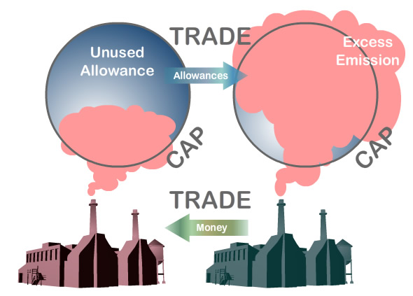

  
```{r setup, include=FALSE}
knitr::opts_chunk$set(warning = FALSE, message = FALSE, 
                      fig.retina = 3, fig.align = "center")
```

# Environmental Regulation and Rulemaking

.pull-left[
<figure>
  
</figure>

]

.pull-right[

**EVSS-PUBA 534: Environmental Law and Regulatory Policy**

**Spring 2022**

.light[Matthew Nowlin, PhD<br>
Department of Political Science<br>
College of Charleston
]

]

---

class: title title-2 

# Overview 

**What is regulation?** 

**Why regulate?** 

**Regulatory instruments** 

**Administrative rulemaking** 

---

class: middle 

# What is regulation?

---

class: title title-2 

# Regulation 

> **Regulation describes the array of public policies explicitly designed to govern economic activity and its consequences at the level of the industry, firm, or individual unit of activity**  

.small[-- Eisner et al., 2018]

--

**Social regulations**: _designed to enforce corporations to accept responsibility for the safety and health of workers and consumers, as well as for the negative by-products of the production process_ 

???
economic regulations 
---

class: title title-2 

# Regulatory Regimes 

> **A historically specific configuration of policies and institutions which structures the relationships between social interests, the state, and economic actors in multiple sectors of the economy** 

.small[-- Eisner, 2000]

--

_Whenever there is a change in regime, it is possible to identify a unique synthesis of interests, political-economic ideas, and administrative reform doctrines that shape the new regime_ 

---

class: title title-2 

# Regulatory Regimes 

**Market regime: 1880s-1920** 

--

**Associational regime: 1930s-1940s** 

--

**Societal regime: 1960s-1970s** 
* **Goal**: Prevention of hazards to health and the environment 

--
* **Political-economy context**: Postwar economic growth and postmaterialist values 

--
* **Policy**: Social regulations 

???
* **Goal**: Promotion of market governance
* **Political-economy context**: Large scale corporate economy and national markets 
* **Policy**: Antitrust regulations 
---

class: title title-2 

# Regulatory Regimes 

**Efficiency regime: 1980s-1990s** 

* **Goal**: Elimination of policies that interfere with market mechanisms or impose large compliance costs 

--
* **Political-economy context**: Economic stagflation and growing foreign competition 

--
* **Policy**: Deregulation, market-based approaches, cost-benefit analysis 

---

class: middle 

# Why regulate?

---

class: title title-2 

# Theories of Regulation 

**Public interest theory** 

--

* Regulation is in the public interest, it makes the society better off 

--

* Often in response to _market failures_ 
  * **Externalities** 
  * **Public goods** 
  * **Common-pool goods**
  * Market power 
  * Asymmetric information 

---

class: title title-2 

# Theories of Regulation 

**Public interest theory** 

* Regulation is in the public interest, it makes the society better off 


**Is there agreement on what is in the public interest?** 

--

_... so much of politics entails people fighting over what the public interest is and trying to realize their own definitions of it_ 

.small[-- Stone, 2012]

---

class: title title-2 

# Theories of Regulation 

**Capture theory** 

--
* Regulation serves private interests 

--
* Transactional: political support from industry in exchange for policies  

--
* "Cognitive capture": accepting the _framing_  of industry interests 

--
* Decline in interest and original constituency over time 

--
* Strong vs weak capture 

--

**When is capture more likely to occur?**  

---

class: title title-2 

# Theories of Regulation 

**Economic theory of regulation** 

--

**Assumes** 
* _Government’s basic resource is the power to coerce_

--
* _An interest group that can convince the government to use its coercive power to the group’s benefit can improve its well-being at the expense of others_

--
* _Agents (firms, individuals, government officials, and interest groups) are rational and try to maximize their own utility (well-being)_ 

---

class: title title-2 

# Theories of Regulation 

**Economic theory of regulation** 

* _... less applicable to the social regulations that have been dominant since the late 1960s_ (Eisner, 2018)  

--

**Bootleggers and Baptists** 

--

**Advocacy Coalition Framework** 

???
**Bootleggers and Baptists**: an economic explanation for social regulations 
---

class: title title-2 

# Theories of Regulation 

**Public choice** 

--

* Applies _economic_ assumptions of human behavior to the public sector 
  * Self-interest (utility-maximizers)
  * Not omniscient (boundedly rational)

--

* **Rent seeking** 

--
* Government failures 

---

class: middle 

# Regulatory instruments 

---

class: middle 

## A _regulatory instrument_ is a set of rules or restrictions that govern an activity, including directions on what happens if people undertake too much, or too little of that activity 

.small[
-- Rowell and van Zebem, pg. 59
]

---

class: title title-2

# Regulatory Instruments 

**Command-and-control** 

--
* _The prohibition or prescription of a specific behavior ... through permits or bans_ 

--

* **Performance** vs **Technology** standards  

--

**Strengths?** 

--

**Weaknesses?** 

---

class: title title-2

# Regulatory Instruments 

**Economic instruments (aka market-based)** 

--

* "Price" behavior to incentivize different behavior  

--

* **Using markets** vs **Creating markets** 

---

class: title title-2

# Regulatory Instruments 

**Using markets** 

.pull-left[
**Externality** 

Social cost $>$ Private cost

Socially efficient outcome = Private cost + **Price** 

**Internalize the externality** 
]

.pull-right[
<figure>
  
</figure>
]

---

class: title title-2

# Regulatory Instruments 

**Creating markets** 

.pull-left[
**Common-pool good = no property rights**
* _Individual fishing quota_  markets

**Allowances create de-facto property rights** 
]

.pull-right[
<figure>
  
</figure>
]


---

class: title title-2

# Regulatory Instruments 

**Ideally pricing policies are equivalent** 

.pull-left[
**Policy sets the demand curve** 
* Fixed quantity (X*)
  * Cap-and-trade 

* Fixed price (T*)
  * Tax 

**$/Ton is the same** 
]


.pull-right[
</br>
<figure>
  
</figure>
]

---

class: title title-2

# Regulatory Instruments 

**Economic instruments (aka market-based)** 


**Strengths?** 

--

**Weaknesses?** 

---

class: title title-2

# Regulatory Instruments 

**Information-based instruments** 

--

* Provide information to change behavior, such as _labels_ and _disclosures_ 

--

**Strengths?** 

--

**Weaknesses?** 

---

class: title title-2

# Regulatory Instruments 

**Behavioral instruments** 

--

* _Nudges_ ... _default rules_ and _framing_  

--

**Strengths?** 

--

**Weaknesses?** 

---

class: title title-2

# Instrument Choice 

**Constraints** 

* **Institutional and legal**: 
  * separation of power and functions
  * statutory language 

--

* **Practical**: capacity (expertise, budget)

--

* **Path dependency**: past decisions inform current decisions ... _continue existing practices even if better is available_

---

class: title title-2

# Cost-Benefit Analysis 

**Measure the costs and benefits of each possible policy and then choose the policy that is most _efficient_** 

--

**Steps** 
1. Specify set of policy alternatives

--
1. Determine benefits and costs of stakeholders

--
1. Monetize impacts

--
1. Discount to _net present value_ 
  * Time value of money: Future value vs. present value of $100

--
1. Make recommendation 

---

class: middle

# Administrative rulemaking 

---

class: middle 

.large[
> **To a very large extent, public policy in the United States is established through administrative rulemaking.**] 

.small[-- Rosenbloom, 2015, pg. 64]

---

class: title title-2

# Administrative Rulemaking

**Characteristics of rules** 

1. Usually prospective 

--

1. Types: 
  * _Legislative_ 
  * _Procedural_
  * _Interpretive_ 

--

1. General (clean air) or particular (use of a pesticide)

---

class: title title-2

# Rulemaking Processes

**Informal (notice and comment) rulemaking** 

--

**APA Requirements** 

1. Notify affected persons or publish a notice of proposed rulemaking (NPRM)

--
1. Interested persons have an opportunity to participate (comments)

--
1. Incorporate comments 

--
1. At least 30 days before a final rule takes effect 

--
1. Right to petition for the _issuance, amendment, or repeal of a rule_ 

---

<figure>
<center>
  
</figure>

---

class: title title-2

# Rulemaking Processes

**Formal rulemaking** 

--

**Hybrid rulemaking** 
* Combines formal and informal rulemaking 
* More flexible than formal and more participatory than informal

--

**Negotiated rulemaking (Reg-Neg)** 

---

class: title title-2

# For Next Time 

**Air Pollution: I** 

.tiny[
* _Readings_:
	- [Summary of the Clean Air Act](https://www.epa.gov/laws-regulations/summary-clean-air-act)

	- **Bearden et al.**, _Clean Air Act_, pgs. 3-24, from Bearden, David M. et al. 2013. _Environmental Laws: Summaries of Major Statutes Administered by the Environmental Protection Agency_. Washington D.C.: Congressional Research Service.

	- Boyd, William. 2019. “The Clean Air Act’s National Ambient Air Quality Standards: A Case Study of Durability and Flexibility in Program Design and Implementation.” In _Lessons from the Clean Air Act: Building Durability and Adaptability into U.S. Climate and Energy Policy_, eds. Ann Carlson and Dallas Burtraw. Cambridge University Press, 15–56. 

	- **SKIM**: Liu, Jiawen et al. 2021. “Disparities in Air Pollution Exposure in the United States by Race/Ethnicity and Income, 1990–2010.” _Environmental Health Perspectives_ 129(12).
]

---

class: title title-2

# In-Class Assignment 

**Find a federal or state regulation** 

.small[
* Federal
  * EPA: https://www.epa.gov/laws-regulations/regulations
  * Federal Register: https://www.regulations.gov/ 

* State
  * SCDHEC: https://scdhec.gov/laws-regulations 

**Report out to class: the regulation, what it covers, and its statutory authority** 

**Write that same information up (include a link to the webpage) and put in the assignment folder on OAKS**
]


