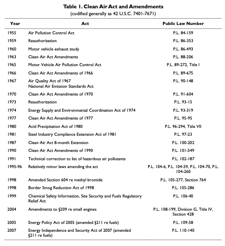
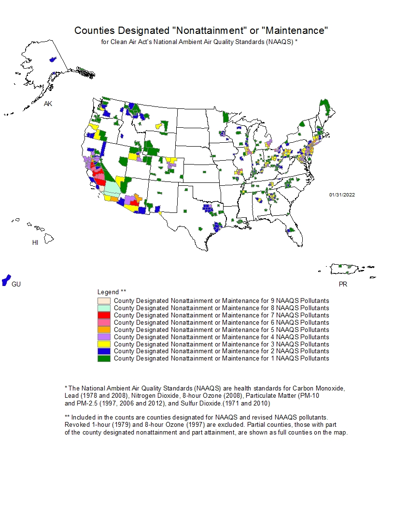
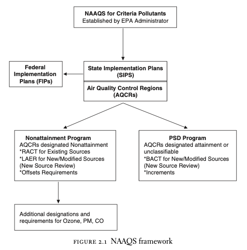
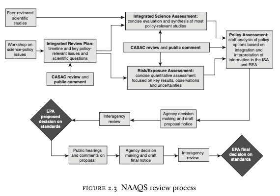

  
```{r setup, include=FALSE}
knitr::opts_chunk$set(warning = FALSE, message = FALSE, 
                      fig.retina = 3, fig.align = "center")
```

# Air Pollution I 

.pull-left[
<figure>
  
</figure>

]

.pull-right[

**EVSS-PUBA 534: Environmental Law and Regulatory Policy**

**Spring 2022**

.light[Matthew Nowlin, PhD<br>
Department of Political Science<br>
College of Charleston
]

]

---

class: title title-2 

# Air Pollution 

> **Air pollution is a mix of particles and gases that can reach harmful concentrations both outside and indoors. Its effects can range from higher disease risks to rising temperatures. Soot, smoke, mold, pollen, methane, and carbon dioxide are a just few examples of common pollutants.** 

.small[-- _National Geographic_] 

---

class: title title-2 

# Air Pollution 

> **Decades of research across multiple disciplines have revealed significant associations between exposure to ambient air pollution and negative human health effects, including respiratory ailments, cardiovascular disease and premature death.** 

.small[-- Boyd 2019, pgs. 18-19]

???
**Ambient air is atmospheric air in its natural state**. It is what we breathe when the atmosphere is not contaminated by airborne pollutants. The composition of ambient air varies depending on the elevation above sea level as well as human factors such as the level of pollution.
---

class: title title-2 

# Air Pollution 

**Donora, Pennsylvania 1948** 

<iframe width="560" height="315" src="https://www.youtube.com/embed/noGkgh2bl4s" title="YouTube video player" frameborder="0" allow="accelerometer; autoplay; clipboard-write; encrypted-media; gyroscope; picture-in-picture" allowfullscreen></iframe>

???
temperature inversion: a layer of warm air is trapped between two layers of cold air 
---

class: middle 

# The Clean Air Act 

---

class: title title-2

# The Clean Air Act 

**What to regulate**  
* Which air pollutants, and which to prioritize 

--

**How much to regulate** 
* How much of the pollutant should be allowed?
* "Public" health  

---

class: title title-2

# The Clean Air Act 

**Where to regulate** 
* Source of pollution or point of impact 
* Set at source (e.g., smokestack)

--

**How to regulate** 
* Which regulatory instruments to use

---

class: title title-2

# The Clean Air Act 

* Defines **air pollutant** as _any physical, chemical, biological, radioactive substance or material which is emitted into or otherwise enters the ambient air_ 

--

* Implemented through [EPA Office of Air and Radiation](https://www.epa.gov/aboutepa/about-office-air-and-radiation-oar)

---

class: title title-2

# The Clean Air Act: History 

<figure>
<center>
  
</figure>

---

class: title title-2

# The Clean Air Act: History 

**1963**: The Clean Air Act of 1963 
* Established program in the US Public Health Service 
* Funds for research into monitoring and control 

--

**1967**: Air Quality Control Act 
* Established _air quality control regions_ (AQCR)
* Left it to states to adopt and enforce pollution control in those regions

---

class: title title-2

# The Clean Air Act: History 

**1970** : Amendments 
* Directed EPA to set national ambient air quality standards (NAAQS)

--

* Permit for every new source 
  * New source performance standards 

---

class: title title-2

# The Clean Air Act: History 

**1970** : Amendments 
* Required automobile manufacturers to reduce pollution by 90%
  * _Technology forcing_   


--

* Risk based standards for hazardous air pollutants 

--

* Federal grants for staffing state agencies

---

class: title title-2

# The Clean Air Act: History 

**1977**: Amendments 
* Prevention of Significant Deterioration (PSD) in areas with high air quality

--

**1990**: Amendments 
* Created cap-and-trade program for $\text{SO}_2$

---

class: title title-2

# The Clean Air Act 

**Main features of the Clean Air Act** 

--

* Cooperative federalism

--

* Notice and comment rulemaking 

--

* Cost-benefit analysis 

--

* Citizen suits 

---

class: title title-2

# The Clean Air Act: Overview 

[Title I - Air Pollution Prevention and Control](https://www.epa.gov/clean-air-act-overview/clean-air-act-title-i-air-pollution-prevention-and-control-parts-through-d) 

-   [Part A - Air Quality and Emission Limitations](https://www.epa.gov/clean-air-act-overview/clean-air-act-title-i-air-pollution-prevention-and-control-parts-through-d#ia) (CAA § 101-131; USC § 7401-7431 )
-   [Part B - Ozone Protection](https://www.epa.gov/clean-air-act-overview/clean-air-act-title-i-air-pollution-prevention-and-control-parts-through-d#ib) (replaced by Title VI)
-   [Part C - Prevention of Significant Deterioration of Air Quality](https://www.epa.gov/clean-air-act-overview/clean-air-act-title-i-air-pollution-prevention-and-control-parts-through-d#ic) (CAA § 160-169b; USC § 7470-7492)
-   [Part D - Plan Requirements for Nonattainment Areas](https://www.epa.gov/clean-air-act-overview/clean-air-act-title-i-air-pollution-prevention-and-control-parts-through-d#id) (CAA § 171-193; USC § 7501-7515)

---

class: title title-2

# The Clean Air Act: Overview 

[Title II - Emission Standards for Moving Sources](https://www.epa.gov/clean-air-act-overview/clean-air-act-title-ii-emission-standards-moving-sources-parts-through-c)

-   [Part A - Motor Vehicle Emission and Fuel Standards](https://www.epa.gov/clean-air-act-overview/clean-air-act-title-ii-emission-standards-moving-sources-parts-through-c#iia) (CAA § 201-219; USC § 7521-7554)
-   [Part B - Aircraft Emission Standards](https://www.epa.gov/clean-air-act-overview/clean-air-act-title-ii-emission-standards-moving-sources-parts-through-c#iib) (CAA § 231-234; USC § 7571-7574)
-   [Part C - Clean Fuel Vehicles](https://www.epa.gov/clean-air-act-overview/clean-air-act-title-ii-emission-standards-moving-sources-parts-through-c#iic) (CAA § 241-250; USC § 7581-7590)

---

class: title title-2

# The Clean Air Act: Overview 

[Title III - General](https://www.epa.gov/clean-air-act-overview/clean-air-act-title-iii-general-provisions) (CAA § 301-328; USC § 7601-7627)

[Title IV - Noise Pollution](https://www.epa.gov/clean-air-act-overview/clean-air-act-title-iv-noise-pollution) (USC § 7641-7642). 

[Title IV-A - Acid Deposition Control](https://www.epa.gov/clean-air-act-overview/clean-air-act-title-iv-subchapter-acid-deposition-control) (CAA § 401-416; USC § 7651-7651o) 

[Title V - Permits](https://www.epa.gov/clean-air-act-overview/clean-air-act-title-v-permits) (CAA § 501-507; USC § 7661-7661f )

[Title VI - Stratospheric Ozone Protection](https://www.epa.gov/clean-air-act-overview/clean-air-act-title-vi-stratospheric-ozone-protection) (CAA § 601-618; USC § 7671-7671q )

---

class: title title-2

# The Clean Air Act: Sections 

**Section 108: Air quality criteria and control techniques**

* Requires EPA to identify air pollutants that may "_reasonably be anticipated to **endanger** public health or welfare_" 

--
* From either _stationary_ or _mobile_ sources

--
* Issue air quality criteria that: _shall accurately reflect the latest scientific knowledge useful in indicating the kind and extent of all identifiable effects on public health or welfare which may be expected from the presence of such pollutant in the ambient air, in varying quantities_

---

class: title title-2

# The Clean Air Act: Sections 

**Section 109: National Ambient Air Quality Standards (NAAQS)**

The EPA must establish NAAQS for air pollutants that endanger public health or welfare ... and whose presence in ambient air results from numerous or diverse sources 

--

* _Primary_ standards: protect human health 
* _Secondary_ standards: includes animals, wildlife, water, and visibility 
* **Standards are uniform and based on health considerations**  

---

class: title title-2

# The Clean Air Act: NAAQS 

**Six criteria air pollutants** 
* Sulfur dioxide (SO2) **2010**
* Particulate matter (PM2.5, PM10) **2013**
* Nitrogen dioxide (NO2) **2010**
* Carbon monoxide (CO) **2011**
* Ozone **2015**
* Lead **2014**

[NAAQS Standards](https://www.epa.gov/criteria-air-pollutants/naaqs-table)

---

class: title title-2

# The Clean Air Act: Sections 

**Section 110: State Implementation Plans** 

EPA sets NAAQS standards, but the states are responsible for establishing procedures to attain and maintain the standards 

--

Requires states to develop and submit to EPA for approval _state implementation plans_ (SIPs) specifying measures to assure that air quality within each state meets the NAAQS 
* An example of _cooperative federalism_ 

---

class: title title-2

# The Clean Air Act: Sections 

**Section 110: State Implementation Plans** 

.pull-left[
**Attainment and non-attainment areas**
* States with _nonattainment_ areas must initiate new SIPs 
* EPA may initiate a FIP
* _Offsets_  
]

???
**Offsets**: _Creates a bubble over an air quality region. A new or modified source may not pollute unless it offsets its emissions by reductions from existing sources in the region._

--

.pull-right[
<figure>
<center>
  
</figure>
]

---

class: title title-2

# The Clean Air Act: Sections 

**Section 110: State Implementation Plans** 

**Interstate air pollution (1977 Amendments)** 
* _SIPs must include adequate provisions to prevent sources within that state from contributing significantly to nonattainment in one or more downwind states._

--
* Prohibited reliance on dispersion techniques 

--
* **Section 126**: allows downwind states to force changes in upwind states' SIPs 

---

class: title title-2

# The Clean Air Act: Sections 

**Title I Part C: Prevention of Significant Deterioration (PSD)** 

* Protects areas with high air quality (i.e., above NAAQS standards)

--

* Includes: SO2, Particulate matter, NO2

--

* Three classes 
	* Class I: national parks, wilderness, pristine areas
	* Class II: attainment and not classifiable areas 
	* Class III: areas designated for development 

---

class: title title-2

# The Clean Air Act: Sections 

**Title I Part C: Prevention of Significant Deterioration (PSD)** 

* Must install **best available control technology (BACT)** that may be stricter than that required by NSPS.

---

class: title title-2

# The Clean Air Act: NAAQS 

<figure>
<center>
  
</figure>


---

class: title title-2

# The Clean Air Act: NAAQS 

<figure>
<center>
  
</figure>

???
_Independent scientific review has played a fundamental role in the NAAQS program, bolstering EPA’s own scientific efforts and helping to maintain the credibility of the program. This has contributed significantly to the political durability of the NAAQS. As noted earlier, Congress was an important early driver in this respect, instructing EPA in the 1977 amendments to create an independent Clean Air Science Advisory Committee (CASAC) that would play a formal role in the NAAQS review and revision process_
---

class: title title-2

# The Clean Air Act: Sections 

**Section 111: Standards of performance for new stationary sources** 

Requires EPA to establish nationally uniform standards for major new stationary sources of air pollution 

--

* _New Source Performance Standards_ (NSPSs)
	* Establish maximum emission levels for new major stationary sources 

--

* _New Source Review_
	* Major new sources or major new modifications 

---

class: title title-2

# The Clean Air Act: Sections 

**Section 112: Hazardous Air Pollutants** 

* Rewritten by 1990 Amendments 

--

* 18~~9~~7 pollutants specifically listed in the legislation

--

* Maximum Achievable Control Technology (MACT) requirements 

--

* Health-based standards for residual risk

---

class: title title-2

# The Clean Air Act

**Enforcement** 

**Section 113**: Federal authority to issue agency and court orders to require compliance and impose penalties 

--

**Section 114**: Federal authority to require sources to submit reports, monitor emissions, and certify compliance 

--

**Title III, Section 304**: Citizen suits 

---

class: title title-2

# The Clean Air Act

**Title II: Emission Standards for Moving Sources** 

--

**Title IV-A: Acid Deposition Control**

_To introduce some flexibility in the distribution and timing of reductions, the act creates a comprehensive permit and emissions allowance system._

---

class: title title-2

# The Clean Air Act

**Title V: Permits** 

* Requires states to administer a comprehensive permit program for the operation of sources emitting air pollutants

--
* Generally sources that emit 100 tons per year of any regulated pollutant

--
* The permit states how much of which air pollutants a source is allowed to emit

--
* Source must prepare a compliance plan and certify compliance

--
* Permit period is five years

???
Added in 1990 Amendments 
---

class: title title-2

# The Clean Air Act

**Title VI: Stratospheric Ozone Protection** 

_Represents the United States’ primary response on the domestic front to the ozone depletion issue. It also implements the U.S. international responsibilities under the Montreal Protocol on Substances that Deplete the Ozone Layer (and its amendments)_ 

* Ozone reduction requirements are a result of amendments to the Montreal Protocol 

---

class: title title-2

# The Clean Air Act

**Environmental rights** 

**Sustainable development** 

**Utilitarianism and cost-benefit analysis** 

**Environmental justice** 

---

class: title title-2

# For Next Time 

**Air Pollution: II**

.small[
* _Readings_:
	- Rabe, Barry G. 2019. “Leveraged Federalism and the Clean Air Act: The Case of Vehicle Emissions Control.” In Lessons from the Clean Air Act: Building Durability and Adaptability into US Climate and Energy Policy, eds. Ann Carlson and Dallas Burtraw. Cambridge: Cambridge University Press, 113–58. 
	
	- Patashnik, Eric M. 2019. “The Clean Air Act’s Use of Market Mechanisms.” In Lessons from the Clean Air Act: Building Durability and Adaptability into US Climate and Energy Policy, eds. Ann Carlson and Dallas Burtraw. Cambridge: Cambridge University Press, 201–24. 
]

---

class: title title-2

# In-Class Assignment 

**Case briefs. See instructions on OAKS** 

**Group 1**: _Union Electric Company v. Environmental Protection Agency (1976)_ 

**Group 2**: _Lead Industries Association, Inc. v. Environmental Protection Agency (1980)_

**Group 3**: _Whitman v. American Trucking Association (2001)_ 

**Group 4**: _Environmental Defense v. Duke Energy Corp (2007)_ 
