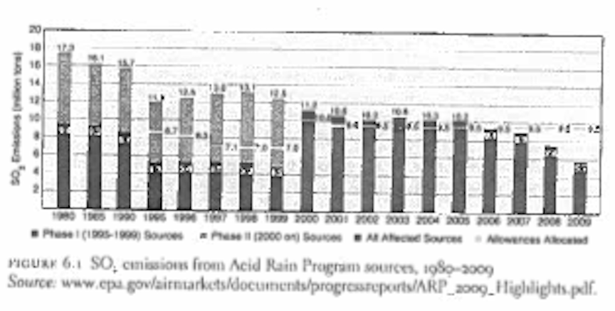

  
```{r setup, include=FALSE}
knitr::opts_chunk$set(warning = FALSE, message = FALSE, 
                      fig.retina = 3, fig.align = "center")
```

# Air Pollution II 

.pull-left[
<figure>
  
</figure>

]

.pull-right[

**EVSS-PUBA 534: Environmental Law and Regulatory Policy**

**Spring 2022**

.light[Matthew Nowlin, PhD<br>
Department of Political Science<br>
College of Charleston
]

]

---

class: middle 

# Quick refresher

---

class: title title-2 

# Risk Assessment

**Four principal steps in the risk assessment process** 

* _Hazard identification_

* _Dose-response assessment_

* _Exposure assessment_

* _Risk characterization_

---

class: title title-2 

# Risk Assessment 

<figure>
<center>
  
</figure>

---

class: title title-2 

# Risk Assessment 

.pull-left[
<figure>
<center>
  
</figure>
]

.pull-right[
**Human perception processes**: the _psychology_ of risk and uncertainty; subject to biases and heuristics 

**Human valuation processes**: willingness-to-pay; value of a statistical life

]

---

class: title title-2 

# Cost-Benefit Analysis 

**Major steps** 

1. Specify the set of alternatives
1. Catalog the costs and benefits and select measurement indicators
1. Monetize all costs and benefits
1. Discount benefits and costs to obtain _net present values_
1. Compute the net present value of each alternative
1. Based on net present values determine the most efficient alternative

---

class: title title-2 

# Cost-Benefit Analysis 

**How are benefits measured?** 

**Willingness-to-pay**

_A way to determine a person's value for a particular good; what they would willingly give up in exchange_ 

--
* Travel-cost method
* Hedonic price method 
* Contingent valuation

--

**Value of a Statistical Life** 

---

class: title title-2 

# Value of a Statistical Life

**Estimates of how much people are willing to pay for small reductions in their risks of dying from adverse health conditions that may be caused by environmental pollution**

_Environmental Protection Agency_

**EPA value: $10 million**

--

**Value of Mortality Risk Reduction**: _reported in units such as dollars per micro-risk per person per year, where a “micro-risk” represents a one in a million chance of dying_ 

.small[See: https://www.epa.gov/environmental-economics/mortality-risk-valuation]

---

class: title title-2 

# Value of a Statistical Life

<figure>
<center>
  
</figure>

---

class: title title-2 

# Value of a Statistical Life

<figure>
<center>
  
</figure>

---

class: middle 

# Clean Air Act: Mobile sources 

---

class: title title-2 

# Key Concepts 

**Federalism** 

* Cooperative federalism 

--
* _Leveraged federalism_ 

???
Leveraged federalism: _formally allows a single state to adopt its own regulatory standards through legislation or administrative provisions that are more demanding than federal standards_

--

**Policy diffusion** 
* Horizontal and vertical 

--

**Market-based approaches** 

---

class: title title-2

# Pollutants from Mobile Sources

.pull-left[
* Carbon Monoxide 
* Particulate matter 
* Nitrogen oxides 
* Hydrocarbons 
* Volatile Organic Compounds (VOCs)
* Ground Level Ozone
  * Smog: mix of smoke and fog
]


.pull-right[
<figure>
  
</figure>
]

---

class: title title-2

# Pollutants from Mobile Sources

**Leading problem indicators** 

--

* America's "car culture" 

--

* Rapid expansion of highway system in the 1950s 

--

* Los Angeles County "five day siege of smog" in 1953 

--

* Mounting evidence in the 1950s and 1960s of health risks 


---

class: title title-2

# Clean Air Act: Mobile Sources 

[Title II - Emission Standards for Moving Sources](https://www.epa.gov/clean-air-act-overview/clean-air-act-title-ii-emission-standards-moving-sources-parts-through-c)

-   [Part A - Motor Vehicle Emission and Fuel Standards](https://www.epa.gov/clean-air-act-overview/clean-air-act-title-ii-emission-standards-moving-sources-parts-through-c#iia) (CAA § 201-219; USC § 7521-7554)
-   [Part B - Aircraft Emission Standards](https://www.epa.gov/clean-air-act-overview/clean-air-act-title-ii-emission-standards-moving-sources-parts-through-c#iib) (CAA § 231-234; USC § 7571-7574)
-   [Part C - Clean Fuel Vehicles](https://www.epa.gov/clean-air-act-overview/clean-air-act-title-ii-emission-standards-moving-sources-parts-through-c#iic) (CAA § 241-250; USC § 7581-7590)

---

class: title title-2

# Clean Air Act: Mobile Sources 

**Section 202: Performance standards for new vehicles**  

Standards for any class of vehicle or engine with emissions that cause or contribute to air pollution that may reasonably be anticipated to endanger public health or welfare 

--

**1970 Amendments**

Called for 90 percent reduction in HC, CO, and NOx by 1975 (HC, CO) - 1976 (NOx) model years 
* Technology-forcing

???
Set by Congress not the EPA

Politics involved a competition between Nixon and Sen. Ed Muskie   

---

class: title title-2

# Clean Air Act: Mobile Sources 

<figure>
<center>
  
</figure>

---

class: title title-2

# Clean Air Act: Mobile Sources 

**1990 Amendment**: Stricter tailpipe standards for light-duty cars and trucks

* Tier I: phased in from 1994-1998 
* Tier II: phased in from 2004-2008 

--

**The Energy Policy and Conservation Act (1975)**
* Established _Corporate Average Fuel Economy_ (CAFE) standards for fuel efficiency 
  * Set by the _DOT_ and _EPA_ 

---

class: title title-2

# Clean Air Act: Mobile Sources 

**Policy diffusion: California as a policy pioneer** 

--
* California Air Pollution Control Act of 1947

--
* Air Quality Control Act of 1967 preempted other states, but left a waiver (carve out) for California 

--

* California standards adopted by 12 other states and became defacto national standard 

--

* Rescinded by Trump Administration in 2019 

--

* Being put back in place by Biden Administration 

---

class: middle 

# Market-based instruments 

---

class: title title-2

# CAA: Market-Based Instruments 

**Incorporate market principles into government policies**  

--

**Markets provide gains from trade** 
 
--

**Markets promote efficiency** 

**Efficiency**
* **Maximizing net benefits**
* **Pareto efficiency**
* **Output/input** 
* **Everyone is happy** 

---

class: title title-2

# CAA: Market-Based Instruments 

**Market rules** 
* Medium of exchange 
* Way to communicate price 
* _Property rights_ 

--

**Property rights**: Rights to own or control property including the right to use, transfer, or _exclude_ 

---

class: title title-2

# CAA: Market-Based Instruments 

**Getting the prices right: Using markets** 

* Tax an externality 

--

**Creating property rights: Creating markets** 

* Fishing quotas 

* Cap-and-trade 

---

class: title title-2

# Coase Theorem 

.pull-left[
**_Private bargaining will result in the efficient resolution of negative externalities, without the need for government intervention, as long as property rights are fully allocated_**   
]

.pull-right[
<figure>
<center>
  
</figure>
]

---

class: title title-2

# Coase Theorem 

.pull-left[
**Works when _transaction costs_ are low** 

**Transaction costs**: The costs associated with a transaction 
* Monitoring and enforcement 

]

.pull-right[
<figure>
<center>
  
</figure>
]

---

class: title title-2

# Coase Theorem 

**What can we take from Coase?**

* Importance of _property rights_ and _transaction costs_

--

* Self-organization among users can address common-pool resource problems

--

* Markets don't _fail_, rather markets are _missing_
  * Government policy should address property rights and lessen transaction costs 

---

class: title title-2

# CAA: Market-Based Instruments 

.pull-left[
**Advantages**
* Compliance flexibility 
* Innovation 
* Diffusion of technology 
]

--

.pull-right[
**Challenges**
* Political durability 
* Policy durability 
* Adaptability 
]

---

class: title title-2

# CAA: Market-Based Instruments 

**Leaded gasoline phase-down** 

--

* Lasted from 1982 to 1988
* EPA set tiered standards, which larger refineries met 
* Differences in compliance costs 
* _Gains from trade_ 
* Lead credits and constructive allocation 
* Banking 

---

class: title title-2

# Acid Rain 

<figure>
<center>
  
</figure>

---

class: title title-2

# CAA: Market-Based Instruments 

**Sulfur dioxide allowance trading** 

 [Title IV-A - Acid Deposition Control](https://www.epa.gov/clean-air-act-overview/clean-air-act-title-iv-subchapter-acid-deposition-control) (CAA § 401-416; USC § 7651-7651o)

--

_To introduce some flexibility in the distribution and timing of reductions, the act creates a comprehensive permit and emissions allowance system._


---

class: title title-2

# CAA: Market-Based Instruments 

**Sulfur dioxide allowance trading** 

.pull-left[
**Two phases** 
* Phase 1: went into effect in 1995 for 110 plants 
* Phase 2: went into effect in 2000 and required further reductions from over 3000 plants 
]

.pull-right[
<figure>
  
</figure>
]

---

class: title title-2

# CAA: Market-Based Instruments 

**Sulfur dioxide allowance trading** 

**Reasons for success**
* Lower than expected cost with switching to low-sulfur coal 
* Lower costs of scrubbing SO2 
* Banking allowances lead to over compliance during phase 1 
* Technological improvements (scrubbers above regulatory standards)
* Efficient allowance trading market 

---

class: title title-2

# CAA: Market-Based Instruments 

**Sulfur dioxide allowance trading** 

**Falling apart** 

* 2005 the EPA promulgated the Clean Air Interstate Rule (CAIR) 

--

* 2011 EPA promulgated the Cross-State Air Pollution Rule (CSAPR)
  * The value of allowances dropped 
  
---

class: title title-2

# CAA: Market-Based Instruments 

**Nitrogen oxide interstate emission program** 

--

* Existed from 2003-2008 

* **1977 Amendment**: Section 110 and interstate air pollution 

* **1990 Amendment**: Congress created the Ozone Transport Commission (OTC) 

* In 2003 EPA EPA created the NOx Budget Program 

* _Progressive Flow Control_: unused allowances could be used in the future but at a discount rate  

---

class: title title-2

# CAA: Market-Based Instruments 

**Conclusions** 
* Market-based approaches can improve environmental quality by providing economic incentives to reduce pollution 

* Policymakers must design, monitor, and enforce market rules 

* Volatility in cap-and-trade markets occur when allowances fall below expected value 

* Adaptability through periodic updating and revision in response to new scientific information

---

class: title title-2

# For Next Time 

**Climate Change**

.small[
* _Readings_:
	- Crystal, Howard M., Kassie Siegel, Maya Golden-Krasner, and Clare Lakewood. 2019. “Returning to Clean Air Act Fundamentals: A Renewed Call to Regulate Greenhouse Gases Under the National Ambient Air Quality Standards (NAAQS) Program.” _The Georgetown Environmental Law Review_ 31(2): 233–84.
	- [A new Supreme Court case could gut the government’s power to fight climate change](https://www.vox.com/platform/amp/2021/11/3/22758188/climate-change-epa-clean-power-plan-supreme-court)
	- [SCOTUSblog: West Virginia v. Environmental Protection Agency](https://www.scotusblog.com/case-files/cases/west-virginia-v-environmental-protection-agency/)
]

---

class: title title-2

# In-Class Assignment 

**Case briefs. See instructions on OAKS**

**Group 1**: _International Harvester Co., et al., v. Environmental Protection Agency (1973)_ 

**Group 2**: _Natural Resources Defense Council v. Environmental Protection Agency 655 F.2d 318 (D.C. Cir. 1981)_ 

**Group 3**: _North Carolina v. Environmental Protection Agency (2008)_ 
