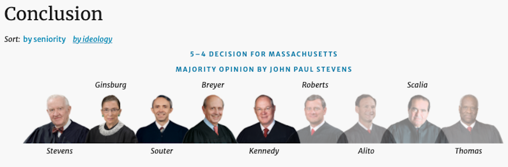

  
```{r setup, include=FALSE}
knitr::opts_chunk$set(warning = FALSE, message = FALSE, 
                      fig.retina = 3, fig.align = "center")
```

# Climate Change  

.pull-left[
<figure>
  
</figure>

]

.pull-right[

**EVSS-PUBA 534: Environmental Law and Regulatory Policy**

**Spring 2022**

.light[Matthew Nowlin, PhD<br>
Department of Political Science<br>
College of Charleston
]

]

---

class: middle 

# Climate change and the Clean Air Act 

---

class: title title-2

# The Clean Air Act 

Defines **air pollutant** as _any physical, chemical, biological, radioactive substance or material which is emitted into or otherwise enters the ambient air_ 

--

**Section 108: Air quality criteria and control techniques**

* Requires EPA to identify air pollutants that may "_reasonably be anticipated to **endanger** public health or welfare_" 


---

class: middle 

# _Massachusetts v. Environmental Protection Agency_ (2007)

---

class: title title-2

# Standing 

**Must meet four requirements** 

* **Injury in fact**: “_an invasion of a legally protected interest which is (a) concrete and particularized, and (b) actual or imminent, not conjectural or hypothetical_.” Lujan, 504 U.S. at 560 
* **Injury can be traced to the challenged action**

.light[
* Redressability: courts can provide a remedy or redress 
* Zone of Interests: Injury falls under the interests or concerns in which the law is intended to protect 
]

---

class: title title-2

# Massachusetts v. EPA 

**Background** 

* **March 1998**: Carol Browner congressional testimony, and subsequent EPA legal opinion 

--
* **Oct 20 1999**: Joe Mendelson from the International Center for Technology Assessment filed a petition with the EPA to regulate greenhouse gasses under the Clean Air Act, Section 202 standards for new motor vehicles

???
This was because the ICTA was working on motor vehicle standards and not focused on power plants
--
* **2000**: George W. Bush supported addressing climate change during the campaign 

---

class: title title-2

# Massachusetts v. EPA 

**Background**

* **Feb 26 2001**: Christine Todd Whitman appears on CNN 

--

* **March 2001**: Bush letter to Republican senators 

--

* **Dec 5 2002**: Mendelson, Sierra Club, and Greenpeace sue to compel EPA action on the petition

---

class: title title-2

# Massachusetts v. EPA 

**Background**

**August  28 2003**: EPA releases two documents
* An opinion "formally withdrawing" the previous EPA general counsel opinion
  * CAA does not authorize EPA to regulate greenhouse gases 
  * Greenhouse gases aren't an "air pollutant" _for climate change purposes_ 

---

class: title title-2

# Massachusetts v. EPA 

**Background**

**August  28 2003**: EPA releases two documents
* A document formally denying the petition 
  * The EPA has no "mandatory duty" to regulate 
  * Now is not the "appropriate time" because more research is needed on "_the causes, extent and significance of climate change and the potential options for addressing it_" 

---

class: title title-2

# Massachusetts v. EPA 

**Background**

* **October 23 2003**: ~30 parties filed petitions with the DC Circuit Court challenging the EPA's denial of the petition, including twelve states, with Massachusetts being the lead state

--

* **April 8 2005**: oral argument begins in front of a three judge panel including Judges David Sentelle (Reagan appointee), Raymond Randolph (HW Bush appointee), and David Tatel (Clinton appointee)

---

class: title title-2

# Massachusetts v. EPA 

**Background**

**Issues before the DC Circuit** 

* Standing 

--

* Are greenhouse gases pollutants under the Clean Air Act? 

--

* Did the EPA have grounds to dismiss the petition?  

---

class: title title-2

# Massachusetts v. EPA 

**Background**

**July 15 2005**: The DC Circuit issues its opinion, 2-1 in favor of EPA

--
* Sentelle: Standing, no "imminent, concrete injury"

--
* Randolph: Petitioners had standing, but EPA had the discretion to wait

--
* Tatel: The petitioners had standing, greenhouses gasses are air pollutants under the CAA, and the EPA acted unlawfully in denying the petition 

???
**The DC Circuit Court issued a "judgement" that didn't establish a legal precedent** 

---

class: middle 

# _The future of the environmental movement is on your head_ 

.small[-Frances Beinecke president of the _Natural Resources Defense Council_]

---

class: title title-2

# Massachusetts v. EPA 

**Background**

* **March 7 2005**: Petition for a _writ of certiorari_, or cert petition filed with the Supreme Court 

???
pronounced “ser-shee-or-RAHR-ee,” rhyming with “Ferrari” or “car key.”
--

* **June 26 2006**: The Supreme Court grants review 

--

* **November 29 2006**: Oral arguments before the Supreme Court 

---

class: title title-2

# Massachusetts v. EPA 

**The questions the Court considered included**: 

1) May the EPA decline to issue emission standards for motor vehicles based on policy considerations not enumerated in the Clean Air Act?

2) Does the Clean Air Act give the EPA authority to regulate carbon dioxide and other greenhouse gases?

---

class: title title-2

# Massachusetts v. EPA 

**April 2 2007** 

<figure>
<center>
  
</figure>

.tiny[see: https://supreme.justia.com/cases/federal/us/549/497/#tab-opinion-1962181]

---

class: title title-2

# Massachusetts v. EPA 

**The questions the Court considered included**: 

1) May the EPA decline to issue emission standards for motor vehicles based on policy considerations not enumerated in the Clean Air Act?

**No** 

2) Does the Clean Air Act give the EPA authority to regulate carbon dioxide and other greenhouse gases?

**Yes** 

---

class: title title-2

# Massachusetts v. EPA 

**Standing**
* Justice Kennedy: states have an interest in protecting their sovereign territory from climate change 
* Justice Roberts: Not really 

--

**Dissent**
* Justice Roberts: Standing and climate policy is not for the courts to decide 
* Justice Scalia: Standing and the merits

---

class: title title-2

# Endangerment Finding 

**December 7 2009**: The EPA issued two distinct findings regarding greenhouse gases under section 202(a) of the Clean Air Act

* **Endangerment Finding:** _The Administrator finds that the current and projected concentrations of the six key well-mixed greenhouse gases—carbon dioxide (CO2), methane (CH4), nitrous oxide (N2O), hydrofluorocarbons (HFCs), perfluorocarbons (PFCs), and sulfur hexafluoride (SF6)—in the atmosphere threaten the public health and welfare of current and future generations_.

.tiny[see: https://www.epa.gov/climate-change/endangerment-and-cause-or-contribute-findings-greenhouse-gases-under-clean-air-act-0]

---

class: title title-2

# Endangerment Finding 

**December 7 2009**: The EPA issued two distinct findings regarding greenhouse gases under section 202(a) of the Clean Air Act

* **Cause or Contribute Finding:** _The Administrator finds that the combined emissions of these well-mixed greenhouse gases from new motor vehicles and new motor vehicle engines contribute to the greenhouse gas pollution that threatens public health and welfare_.

---

class: middle

# Briefly describe the Clean Power Plan 

---

class: middle 

# Briefly describe the Affordable Clean Energy Rule 

---

class: middle 

# _West Virginia v. Environmental Protection Agency_ 

---

class: title title-2

# For Next Time 

**Water Pollution** 

.small[
* _Readings_:
	- [Summary of the Clean Water Act](https://www.epa.gov/laws-regulations/summary-clean-water-act)
	- **Bearden et al.**, _Clean Water Act_, pgs. 25-33, from Bearden, David M. et al. 2013. _Environmental Laws: Summaries of Major Statutes Administered by the Environmental Protection Agency_. Washington D.C.: Congressional Research Service.
	- **Salzman and Thompson**, Chapter 7: _Water Pollution_, from Salzman, James, and Barton H. Thompson Jr. 2014. _Environmental Law and Policy_. 4th ed. St. Paul, MN: Foundation Press.
]

---

class: title title-2

# In-Class Assignment 

**Topic selection paragraph** 

* Word doc on [OAKS](https://lms.cofc.edu)

* Submit in assignment folder 

* Check-out with me before you leave 


