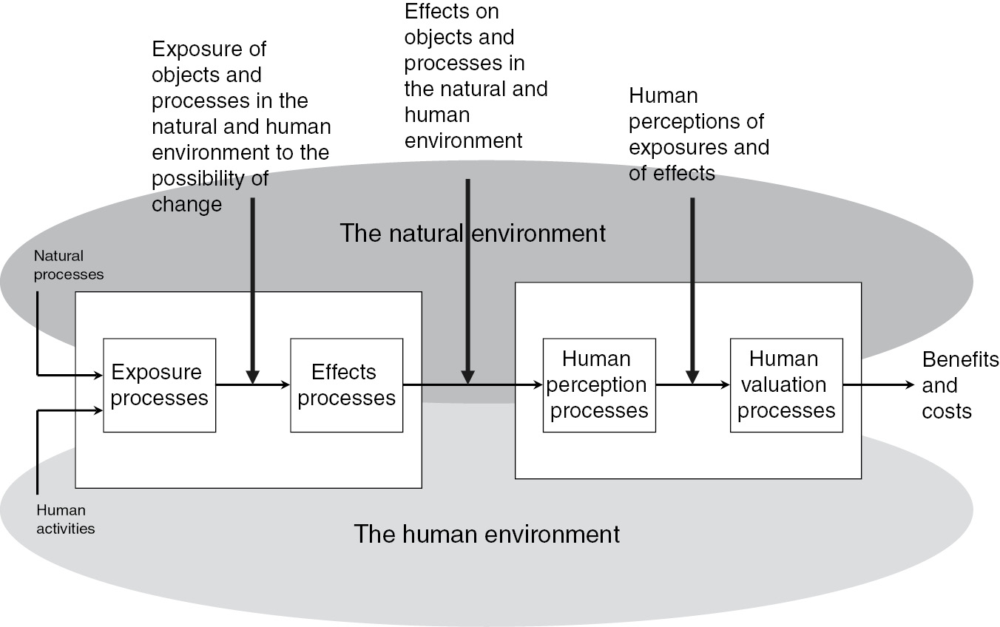
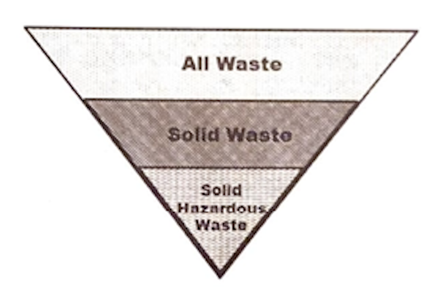

  
```{r setup, include=FALSE}
knitr::opts_chunk$set(warning = FALSE, message = FALSE, 
                      fig.retina = 3, fig.align = "center")
```

# Toxic Substances & <br> Waste Management  

.pull-left[
<figure>
  
</figure>

]

.pull-right[

**EVSS-PUBA 534: Environmental Law and Regulatory Policy**

**Spring 2022**

.light[Matthew Nowlin, PhD<br>
Department of Political Science<br>
College of Charleston
]

]

---

class: middle 

# What are toxic substances? 

---

class: title title-2

# Toxic Substances 

> **Products and by-products presenting a potential risk of serious harm at even low levels of exposure** 

.tiny[**Salzman and Thompson**, Chapter 8: _Regulating Toxic Substances_, pg. 205]

???
differ from air and water pollution
--

* Many toxins are valuable agricultural, industrial, or consumer products 

--
* We are often not sure what degree of risk a suspected toxin poses 

--
* Safe levels of exposure do not exist 

---

class: title title-2

# Toxic Substances 

**Statutes that address toxic substances** 

* **The Toxic Substances Control Act (TSCA) of 1976**
* **The Resource Conservation and Recovery Act (RCRA) of 1976** 
* **The Comprehensive Environmental Response, Compensation, and Liability Act (CERCLA) of 1980** 
* The Federal Insecticide, Fungicide, and Rodenticide Act (FIFRA)
* The Food, Drug, and Cosmetic Act 
* The Atomic Energy Act 
* The Occupational Safety and Health Act 


---

class: middle 

# What are some of the challenges associated with regulating toxic substances? 

---

class: title title-2

# Themes of Environmental Law 

**Risk** 

Environmental law is about mitigating risk to the environment and human health

--

Risk can be defined as the _exposure to the **chance** of **injury or loss**_ 

--
* **Chance**: risk is probabilistic 

--
* **Injury or loss**

--

**Risk assessment** uses scientific information to estimate harm to the environment and human health from various sources

---

class: title title-2 

# Themes of Environmental Law 

**Four principal steps in the risk assessment process**  

--
* _Hazard identification_: Is the item under study (e.g., chemical) causally linked to particular health (or public welfare) effects?   

--

* _Dose-response assessment_: What is the relationship between the magnitude of exposure and the probability that the health (or public welfare) effects will occur?  

???
four steps come from National Research Council: Risk Assessment in the Federal Government: Managing the Process from 1983. Definitions taken from Percival (2013) pg 229
---

class: title title-2 

# Themes of Environmental Law 

**Four principal steps in the risk assessment process**  

* _Exposure assessment_: What is the level of exposure of humans (or the environment) to the hazard? 

--

* _Risk characterization_: What is the overall magnitude of the risk? 
  * Combines the first three steps

---

class: title title-2 

# Risk Assessment 

<figure>
<center>
  
</figure>

---

class: title title-2

# Toxic Substances 


**Tolerable risk** 

???
if 2 out of a million exposed get cancer, should we regulate the substance? 
--

_What risk is acceptable and who should decide?_ 

--

* The acceptability of risk involves probability and severity

--
* Voluntary risks are viewed differently than imposed risks 

--
* _Industrial Union Department v. American Petroleum Institute_ (1980)
  * OHSA only requires a "safe" workplace not a "risk free" workplace 

--
* _Let's apply our four frameworks to the question of tolerable risk_ 

???
environmental rights; sustainable development; cost-benefit analysis; environmental justice

---

class: title title-2

# Toxic Substances 

**Scientific uncertainty** 

--

Risk $\neq$ Uncertainty

--

**Lack of information** 

* The Federal Insecticide, Fungicide, and Rodenticide Act (FIFRA)
  * Requires extensive toxicology tests of _carcinogenic_ risks 

* **The Toxic Substances Control Act (TSCA)**

---

class: title title-2

# Toxic Substances 

**How is cancer risk determined?** 

--
* Epidemiological study

???
wait to see if an exposed population develops cancers 
--
* Animal bioassay 

--

**Regulating under uncertainty** 
* Burden of proof 
* Degree of certainty 
* _Precautionary principle_ 

---

class: title title-2

# Toxic Substances 

**Regulatory options** 

* Ban or limit production OR attempt to control exposure 

--

* Appropriate regulatory standard 
  * Health based 
  * Feasibility 
  * Risk-benefit 
  * _Informational approach_ 

---

class: title title-2

# Toxic Substances 

**Regulatory standard examples** 

**Health based** 
* The _Delaney Clauses_ in the Food, Drug, and Cosmetic Act 
  * Food or color additives are treated as "unsafe" if "found ... to induce cancer in man or animal" 

---

class: title title-2

# Toxic Substances 

**Regulatory standard examples** 

**Feasibility** 
* The Occupational Safety and Health Act (OSHA)
  * Ensure a "safe" work place but only "to the extent _feasible_" 
  * Courts have concluded that standards must be both technically and economically feasible 

--
* Safe Drinking Water Act 
  * As close to the MCLG as is feasible 

???
MCLG: maximum contaminant level goal 
---

class: title title-2

# Toxic Substances 

**Regulatory standard examples** 

**Risk-benefit** 
* The Federal Insecticide, Fungicide, and Rodenticide Act (FIFRA)
  * Manufacturer must register with EPA 
    * the pesticide will do what the manufacturer says 
    * will not pose an "unreasonable risk to man or the environment, taking into account the economic, social, and environmental costs and benefits of the pesticide" 
    
???
when "used in accordance with widespread and commonly recognized practice"
---

class: title title-2

# Toxic Substances 

**Regulatory standard examples** 

**Informational approaches** 

* The Emergency Planning and Community Right-to-Know Act (EPCRA) of 1986
  * Section 313: [The Toxic Release Inventory](https://www.epa.gov/toxics-release-inventory-tri-program/what-toxics-release-inventory) 
  * EPA maintains a list of 650 hazard substances and releases over a specific threshold must be reported to the EPA and the state 

--

* California's Proposition 65 (1986)

---

class: middle 

# The Toxic Substances Control Act (TSCA) of 1976

---

class: title title-2

# The Toxic Substances Control Act (TSCA)

**Title I: Control of Toxic Substances**   

**Section 4: Testing of chemical substances and mixtures** 

.small[_require manufacturers and processors to conduct tests for existing chemicals if (1) their manufacture, distribution, processing, use, or disposal may present an unreasonable risk of injury to health or the environment; or they are to be produced in substantial quantities and the potential for environmental release or human exposure is substantial or significant; (2) existing data are insufficient to predict the effects of human exposure and environmental releases; and (3) testing is necessary to develop such data_] 

---

class: title title-2

# The Toxic Substances Control Act (TSCA)

**Title I: Control of Toxic Substances**   

**Section 4: Testing of chemical substances and mixtures** 

* Established an [Interagency Testing Committee (ITC)](https://www.epa.gov/assessing-and-managing-chemicals-under-tsca/interagency-testing-committee)

--
* TSCA directs the ITC to “designate” a subset of chemicals on the list for EPA action within 12 month

--
* The list can contain no more than 50 “designated” chemicals at any time

--
* EPA has one year to respond by issuing a proposed test rule or a notice explaining why no testing is needed

---

class: title title-2

# The Toxic Substances Control Act (TSCA)

**Title I: Control of Toxic Substances**   

**Section 4: Testing of chemical substances and mixtures** 

.smaller[
.pull-left[
* quantity of the substance to be manufactured
* quantity of the chemical in environmental releases
* number of people who will be exposed occupationally and the duration of exposure
* extent of non-occupational human exposure
* similarity of the chemical to any other chemical known to present an unreasonable risk
]

.pull-right[
* existence of data concerning environmental or health effects of the chemical 
* the quantity of information to be gained by testing
* the availability of facilities and personnel for performing testing
]
]

???
TSCA requires the ITC to consider the following factors when it makes listing decisions:

Chemicals known or suspected to cause or contribute to cancer, gene mutations, or birth defects are to be assigned a higher priority
---

class: title title-2

# The Toxic Substances Control Act (TSCA)

**Title I: Control of Toxic Substances**   

**Section 5: Manufacturing and processing notices** 

_Requires manufacturers, importers, and processors to notify EPA at least 90 days prior to producing or otherwise introducing a new chemical product into the United State_

--
* Test data must be submitted at the same time 

--
* If the EPA determines the substance presents an "unreasonable risk", requirements to protect against that risk must be promulgated 

---

class: title title-2

# The Toxic Substances Control Act (TSCA)

**Title I: Control of Toxic Substances**   

**Section 6: Regulation of hazardous chemical substances and mixtures** 

.smaller[
.pull-left[
* prohibit or limit the amount of production or distribution of a substance in commerce;
* prohibit or limit the production or distribution of a substance for a particular use;
* limit the volume or concentration of the chemical produced;
* prohibit or regulate the manner or method of commercial use;
]
.pull-right[
* require warning labels and/or instructions on containers or products;
* require notification of the risk of injury to distributors and, to the extent possible, consumers;
* require record-keeping by producers;
* specify disposal methods; and
* require replacement or repurchase of products already distributed.
]
]

---

class: title title-2

# The Toxic Substances Control Act (TSCA)

**Title I: Control of Toxic Substances**   

**Section 6: Regulation of hazardous chemical substances and mixtures** 

*EPA is required by TSCA to regulate only “to the extent necessary to protect adequately” against a risk, and to use the “least burdensome” regulatory approach, even in controlling unreasonable risks*

---

class: title title-2

# The Toxic Substances Control Act (TSCA)

**Title I: Control of Toxic Substances**   

**Section 8: Reporting and retention of information** 

.small[
_Requires EPA to develop and maintain an inventory of all chemicals, or categories of chemicals, manufactured or processed in the United States_ 
]

--

.small[
_EPA may require maintenance of records and reporting of chemical identities, names, and molecular structures; categories of use; amounts manufactured and processed for each category of use; descriptions of byproducts resulting from manufacture, processing, use, and disposal; environmental and health effects; number of individuals exposed; number of employees exposed and the duration of exposure; and manner or method of chemical disposal_ 
]

---

class: title title-2

# The Toxic Substances Control Act (TSCA)

**Title I: Control of Toxic Substances**   

**Section 8: Reporting and retention of information** 

.small[
TSCA section 8(e) states that "_Any person who manufactures, [imports,] processes, or distributes in commerce a chemical substance or mixture and who obtains information which reasonably supports the conclusion that such substance or mixture presents a substantial risk of injury to health or the environment shall immediately inform the [EPA] Administrator of such information unless such person has actual knowledge that the Administrator has been adequately informed of such information._" 15 U.S.C. 2607(e)
]

???
Manufacturers, processors, and distributors of chemicals are required to maintain records of significant adverse reactions to health or the environment alleged to have been caused by a substance or mixture. Records of adverse effects on the health of employees must be retained for 30 years from the date of reporting. Industry also must submit lists and copies of health and safety studies. Studies showing adverse effects previously unknown must be submitted to EPA as soon as they are completed or discovered.
---

class: title title-2

# The Toxic Substances Control Act (TSCA)

**Title II: Asbestos Hazard Emergency Response**   

* Enacted in 1986 and amended in July 1988

--
* Required EPA to set standards at levels adequate to protect public health and the environment, for responding to the presence of asbestos in schools. The standards identify appropriate response actions that depend on the physical condition of asbestos. 

--
* Schools, in turn, were required to inspect for asbestos-containing material, and to develop and implement a plan for managing any such material.

---

class: title title-2

# The Toxic Substances Control Act (TSCA)

**Title III: Indoor Radon Abatement** 

* Enacted in October 1988 

--

* Provides financial and technical assistance to the states that choose to support radon monitoring and control

--

* Neither monitoring nor abatement of radon is required by the act

---

class: title title-2

# The Toxic Substances Control Act (TSCA)

**Title IV: Lead Exposure Reduction** 

* **1992**: Residential Lead-Based Paint Hazard Reduction Act of 1992

--

* Accelerate federal efforts to reduce risks to young children who daily are exposed to lead-based paint in their homes 

--

* Stimulate development of lead inspection and hazard abatement services in the private sector, while ensuring that the services provided and any products employed are reliable and effective in reducing risk

---

class: title title-2

# The Toxic Substances Control Act (TSCA)

**Title IV: Lead Exposure Reduction** 

.smaller[
.pull-left[
* promulgate definitions of lead-contaminated dust, lead-contaminated soil, and lead-based paint hazards;
* ensure that people engaged in detection and control of lead hazards are properly trained and that contractors are certified;
* publish requirements for the accreditation of training programs for workers;
* develop criteria to evaluate the effectiveness of commercial products used to
detect or reduce risks associated with lead-based paint;
]

.pull-right[
* establish protocols, criteria, and minimum performance standards for laboratory analysis of lead in paint films, soil, and dust;
* establish a program to certify laboratories as qualified to test substances for lead content; and
* publish and distribute to the public a list of certified or accredited environmental sampling laboratories
]
]

---

class: title title-2

# The Toxic Substances Control Act (TSCA)

**Title V: Healthy High-Performance Schools** 

* **2007**: Energy Independence and Security Act of 2007

--
* Authorizes EPA to establish a state grant program to provide technical assistance for EPA programs to schools and develop and implement state school environmental health programs

--
* State programs must include standards for school building design, construction, and renovation, and identify ongoing school building environmental problems and recommended solutions

--
* Environmental problems include “contaminants, hazardous substances, and pollutant emissions.”

---

class: title title-2

# The Toxic Substances Control Act (TSCA)

**Title VI: Formaldehyde Standards for Composite Wood Products** 

* **2010**: The Formaldehyde Standards for Composite Wood Products Act

--

* Mandates specific formaldehyde emission standards for hardwood plywood, medium-density fiberboard, and particleboard that is sold, supplied, offered for sale, or manufactured in the United States

---

class: middle 

# Waste management 

---

class: title title-2

# Waste Management 

**Why is a waste a problem?** 

--

* We produce a lot of it 

--

* The "landfill crisis" and NIMBY 

--

* Health effects 
  * Contamination of drinking water 
  * Waste incinerators produce dioxins, mercury, and other hazardous air pollutants 
---

class: title title-2

# Waste Management 

**1965**: The Solid Waste Disposal Act 
* Focused on research, demonstrations, and training
* Provided for sharing with the states the costs of making surveys of waste disposal practices and problems, and of developing waste management plans

---

class: title title-2

# Waste Management 

**1970**: The Resource Recovery Act
* Reclamation of energy and materials from solid waste
* authorized grants for demonstrating new resource recovery technology, and required annual reports from EPA on means of promoting recycling and reducing the generation of waste

---

class: title title-2

# Waste Management 

**1976**: The Resource Conservation and Recovery Act (RCRA)

* Creates definitions to determine the classes of wastes under its authority 

???
four basic goals 
--
* Takes a "life-cycle" approach and creates a tracking system for hazardous waste from its creation to its disposal 

--
* Establishes handling standards for wastes from generation to disposal 

--
* Provides authority for mandatory clean-up of polluted treatment, storage, and disposal facilities 

---

class: title title-2

# The RCRA 

**Solid waste vs. hazardous waste** 

???
two questions 1) is it solid waste 2) is it solid hazardous waste 

companies try and keep their waste classified as nonhazardous 

nonhazardous solid waste left mostly to the states 
--

_Solid waste_ is defined in **Section 1004: Definitions** 

.small[_...any garbage, refuse, sludge from a waste treatment plant, water supply treatment plant, or air pollution control facility and other discarded material, including solid, liquid, semisolid, or contained gaseous material resulting from industrial, commercial, mining, and agricultural operations, and from community activities, but does not include solid or dissolved material in domestic sewage, or solid or dissolved materials in irrigation return flows or industrial discharges which are point sources [regulated under the Clean Water Act]...or special nuclear, or byproduct material as defined by the Atomic Energy Act_]

---

class: title title-2

# The RCRA 

**Solid waste vs. hazardous waste** 

.pull-left[
**Solid waste _becomes_ “characteristic” or “listed” hazardous waste** 
* _Characteristic_: exhibits certain hazardous characteristics (ignitability, corrosivity, reactivity, or toxicity)
]

.pull-right[
<figure>
  
</figure>
]

---

class: title title-2

# The RCRA 

**Solid waste vs. hazardous waste** 

.pull-left[
**Solid waste _becomes_ “characteristic” or “listed” hazardous waste** 
* _Listed_: If EPA specifically lists the waste in the Code of Federal Regulations
]

.pull-right[
<figure>
  
</figure>
]


---

class: title title-2

# The RCRA 

**Subtitle C: Hazardous waste**: EPA was directed to, 

* establish standards applicable to hazardous waste generators and transporters;

--
* establish minimum national standards applicable to owners and operators of
hazardous waste _treatment, storage, and disposal facilities (TSDFs)_;

--
* establish a permit program applicable to TSDFs; and

--
* establish criteria for states to administer and enforce their own hazardous waste program 

---

class: title title-2

# The RCRA 

**Generators, Transporters, and TSDFs** 

**Generators**
* If a threshold amount is produced, an identification number must be obtained from the EPA as well as a manifest 

--
* Determine if waste is characteristic or listed 

--
* Ensure proper storage and labeling 

--
* Keep records of testing 

--
* Submit reports 

---

class: title title-2

# The RCRA 

**Generators, Transporters, and TSDFs** 

**Transporters** 
* Must comply with EPA and Department of Transportation requirements; "hazmat" 

--
* Proper packing and labeling, reporting, record keeping, and the manifest

--

**Over 3 billions tons of hazardous materials are transported each year, with 800,000 shipment every day** 

---

class: title title-2

# The RCRA 

**TSDFs** 
* Must obtain a permit from EPA or state agency
  * Permit process is 2 to 4 years; permit good for 10 years 

--
* Satisfy operating requirements including personnel training, record keeping, groundwater monitoring, security, and technical standards 

--
* Create comprehensive plans for closure including maintaining and monitoring for 30 years 

--
* Must provide financial assurance 


---

class: title title-2

# The RCRA 

**1984**: The Hazardous and Solid Waste Amendments
* _Corrective actions_: TSDFs must clean up past or present contamination 

--

* _Land ban_: Prohibited use of landfills unless there would be "no migration" of hazardous constituents from the landfill 

---

class: title title-2

# Waste Management 

**1980**: The Comprehensive Environmental Response, Compensation, and Liability Act (CERCLA)
* Known as "Superfund" 

--

* Responds to problems from _prior_ waste disposal 

???
RCRA address current waste disposal 
--

* Imposes liability to ensure the cleanup of contaminated sites 

--

* _Love Canal_  

???
built of top of a landfill and the buried wastes broke through the clay liner and seep into the soil and basements 
---

class: title title-2

# CERCLA 

**Challenges** 
* How to identify and prioritize problem sites 

--

* Who should perform cleanup 

--

* Who should pay for the cleanup 

--

* How clean is clean 

---

class: title title-2

# CERCLA 

_Authorizes the federal government to clean up contaminated sites in the United States and to make the “potentially responsible parties” connected to those sites financially liable for the cleanup costs_ 

--
* Only requirement is that _any person who knows of a release of a reportable quantity of hazardous waste must notify EPA_.

???
* Government has power to compel parties to clean up releases of hazardous substances 
* government and private parties have the authority to recover costs of cleanup

---

class: title title-2

# CERCLA 

**The Hazardous Substance Superfund Trust Fund** 

_Finance cleanup actions taken by the federal government at contaminated sites where the potentially responsible parties cannot pay or cannot be found_ 

--
* Financed by special taxes on industry and from the General Fund 

--

* Authority to collect taxes from industry expired in 1995 

--

* Availability of funds is to subject to congressional appropriations 

---

class: title title-2

# CERCLA 

**[National Priorities List](https://www.epa.gov/superfund/superfund-national-priorities-list-npl)**

_Lists the most contaminated sites in the United States which present the greatest risks to human health and the environment_ 

--

* Hazard Ranking System 
  * Takes into account a site's toxicity, proximity to local population, potential to contaminate drinking water, among other considerations 
  
---

class: title title-2

# For Next Time 

**Public Trust, Wetlands, and Waters of the United States**

* _Readings_:
  - **Salzman and Thompson**, Chapter 10: _Wetlands, Endangered Species, and the Public Trust_, **pgs. 271-287**, from Salzman, James, and Barton H. Thompson Jr. 2014. _Environmental Law and Policy_. 4th ed. St. Paul, MN: Foundation Press. 
  - Finney, Brad. 2018. “One WOTUS, Two POTUS: The Clean Water Act and the Economic Impact.” _Tennessee Law Review_ 86(4): 895–964.

---

class: title title-2

# In-Class Assignment 

<br>
.large[**Your ticket to leave is my approval of your paper / presentation topic**]


