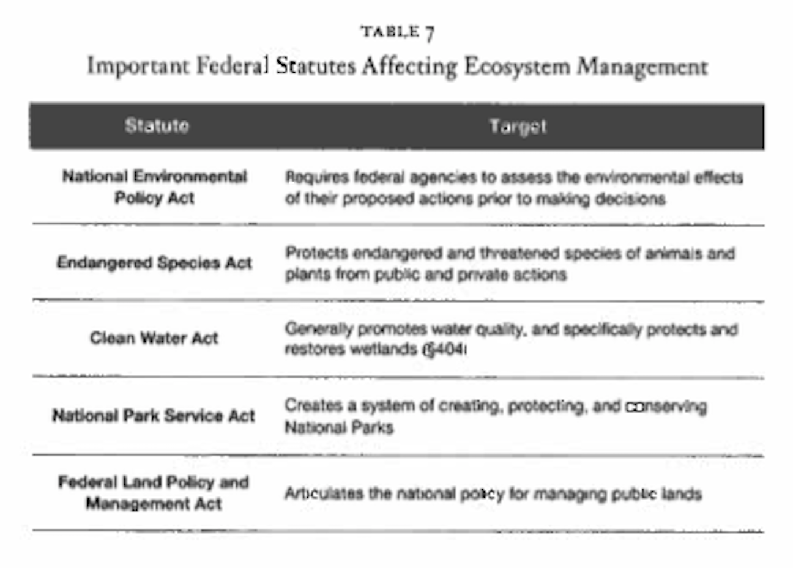
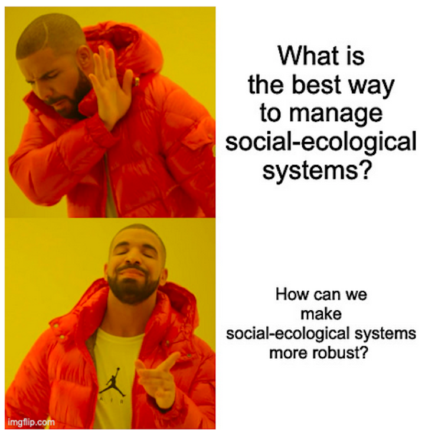
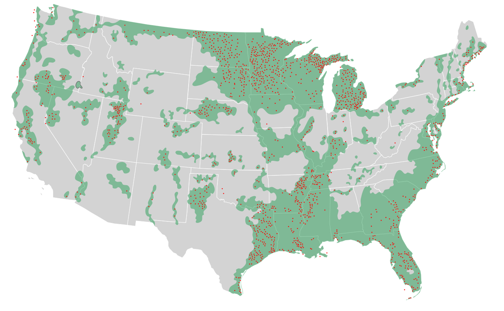

  
```{r setup, include=FALSE}
knitr::opts_chunk$set(warning = FALSE, message = FALSE, 
                      fig.retina = 3, fig.align = "center")
```

# Public Trust Doctrine, Wetlands, & WOTUS 

.pull-left[
<figure>
  
</figure>

]

.pull-right[

**EVSS-PUBA 534: Environmental Law and Regulatory Policy**

**Spring 2022**

.light[Matthew Nowlin, PhD<br>
Department of Political Science<br>
College of Charleston
]

]

---

class: middle 

# Legal and Regulatory Applications to Ecosystem Services

---

class: title title-2

# Ecosystem Management 

**Ecological systems (ecosystems)**: geographic areas where living entities (plants, animals, and other organisms) and nonliving entities (including water, air, and soil) interact in mutually interdependent ways

--

**Ecosystem management**: seeks to preserve, sustain, and secure whole ecosystems and the qualities of ecosystems that are deemed valuable 

* Trade-off competing social, cultural, and environmental values
* _Ecosystem services_: benefits ecosystems provide to humans 

---

class: center, middle

# What are some challenges associated with ecosystem management? 

???
possibility of "tipping points" 

geographic and temporal space 

multiple levels of government

clashing view points of stakeholders

_state, not federal, law primarily controls how much land is developed and used, how much waster is withdrawn from rivers and underground aquifers, the pace of petroleum extraction, and the taking of wildlife and fresh water fish_ 
---

class: title title-2

# Ecosystem Management 

<figure>
<center>
  
</figure>

---

<figure>
<center>
  
</figure>

---

class: middle 

# What is the _public trust doctrine_? 

---

class: title title-2

# Public Trust Doctrine 

> **The [public trust] doctrine posits the government as a trustee of selected natural resources that must be managed for the long-term benefit of the public. A trust is a type of ownership in which one party manages property for the benefit of another party.**

.tiny[Blumm, Michael C., and Mary Christina Wood. 2021. _The Public Trust Doctrine in Environmental and Natural Resources Law_. 3rd ed. Durham, NC: Carolina Academic Press.
]

???
has its orgins in the Roman _law of nature_ 
--

_Some resources are treated as public commons_ 

---

class: title title-2

# Public Trust Doctrine 

**The Northwest Ordinance of 1787** 

_The navigable waters leading into the Mississippi and St. Lawrence ... shall be common highways and forever free ... to the citizens of the United States_

--

**_Illinois Central Railroad Co. v. Illinois_ (1892)** 

* _Lands underlying navigable waterways are "different in character" from other governmentally owned lands_

--
* _Navigable waters are of special importance to the public, and the State holds title ... "in trust for the people"_  

---

class: title title-2

# Public Trust Doctrine 

**Challenges** 

* States, not the federal government, largely control how land is used; where and how much water is withdrawn; resource extraction; and wildlife and freshwater fish extraction

--

* Should the public trust doctrine apply to more than just navigable waters and the underlying land? 

--

* No legislative basis? 

---

class: middle 

# What are wetlands, and how are they regulated? 

---

class: title title-2

# Wetlands 

> **Surface areas that are saturated or inundated with water long enough each year to support hydrophilic ("water-loving") vegetation** 

.tiny[Salzman, James, and Barton H. Thompson Jr. 2014. Environmental Law and Policy. 4th ed. St. Paul, MN: Foundation Press.]

[US Fish and Wildlife Service: National Wetlands Inventory](https://www.fws.gov/program/national-wetlands-inventory)

[EPA: Wetlands Protection and Restoration](https://www.epa.gov/wetlands)

---

class: title title-2

# Wetlands 

> **... areas that are inundated or saturated by surface or ground water at a frequency and duration sufficient to support, and that under normal circumstances do support, a prevalence of vegetation typically adapted for life in saturated soil conditions. Wetlands generally include swamps, marshes, bogs, and similar areas.**

.tiny[EPA and Army Corp (1977)]

---

class: title title-2

# Wetlands 

**Identifying Wetlands** 

Three characteristics are used to identify wetlands:

* **Vegetation** – are plant communities specially adapted to wetlands present?

--
* **Soil** – are “hydric” soils present? Hydric soils have characteristics that indicate they were developed where oxygen was limited by the presence of water for long periods.

--
*  **Hydrology** – is water present for long periods during the growing season?

---

class: title title-2

# Wetlands 

**Provide valuable services:** 

* Protect waterways from a variety of contaminants
	* Retain about 80 percent of phosphorous and 90 percent of nitrogen found in runoff

--
* Forest wetlands lower water temperature in summer, reducing algal blooms 

--
* Reduce risk of floods; act as "natural sponges", soaking up water and slowly releasing it over time 

--
* Crucial habitat for migrating birds and commercial fish species 

---

class: title title-2

# Wetlands 

<figure>
<center>
  
</figure>

---

class: title title-2

# Wetlands 

**Rivers and Harbors Act of 1899** 

**Section 10**: _That the creation of any obstruction not affirmatively authorized by Congress, to the navigable capacity of any of the waters of the United States is hereby prohibited_ 

--

* Includes _dredging, filling, or otherwise altering or modifying "navigable waters"_  

* Requires a permit from the US Army Corp of Engineers 

---

class: title title-2

# Wetlands and the Clean Water Act  

**Section 404: Permits for dredged or fill materials** 

* Anyone who proposes an activity that would discharge dredged or fill material into _navigable waters_ is required to apply for a permit from the U.S. Army Corps of Engineers

--
* EPA develops permitting guidelines 

--
* Dredged material: _material that is excavated or dredged from the waters of the United States_ 

--
* Fill material: _material used for the primary purpose or replacing an aquatic area with dry land or of changing the bottom elevation of a water body_ 
---

class: title title-2

# Wetlands and the Clean Water Act  

**What is a "discharge" of material?**  

???
The Corps has taken a broad interpretation of discharge
--

**Tulloch rule 1993**: 
* EPA and the U.S. Army Corps of Engineers regulation that asserted jurisdiction over "_any_ redeposit of dredged material"

--
* _National Mining Association v. Army Corps of Engineers_ (1999)
	* Tulloch rule exceed USACE authority 

--
* Courts continue to struggle 

---

class: title title-2

# Wetlands 

**Special exceptions include...**

_ongoing farming, ranching and forestry practices, maintenance activities, construction or maintenance of farm or stock ponds or irrigation ditches, construction of temporary sediment basins on a construction site, and construction or maintenance of farm, forest or temporary roads_ 

--

**Recapture provision**: exempt activity may require a permit if it would change the use of the land, impair the "flow or circulation of navigable waters" or reduce the "reach of such waters"  

???
Congress did not intend conversion of wetlands into dry land
---

class: title title-2

# Wetlands and the Clean Water Act  

The 404 permit process requires applicants to demonstrate that they have followed certain steps in a particular order, known as “sequencing”:

--
* **Avoid the impact**: is there a _practicable alternative_? 

--
* **Minimize the impact**: the applicant is required to demonstrate how it can occur with minimal impact to the water body

--
* **Mitigate any impact**: the impact is unavoidable and will be minimized and all _appropriate and practicable_ mitigation will be employed 

???
will not violate other state or federal laws 
---

class: title title-2

# Wetlands and the Clean Water Act  

**General permits** 

* _Generic nationwide, regional, or programmatic permits_  

--

* As long as the actively complies with the conditions of the general permit, individuals permits are not needed

--

* Only about 15 percent of permit application go through regulatory review 

---

class: middle 

# What are _navigable waters_? 

---

class: middle 

# The term _navigable waters_ means the waters of the United States, including the territorial seas

???
CWA section 502 
---

class: middle 

# What does the _waters of the United States_ mean? 

---

class: title title-2

# WOTUS 

**_Rapanos v. United States_ 2006**

Question: _Does the phrase "waters of the United States" in the Clean Water Act include a wetland that at least occasionally empties into a tributary of a traditionally navigable water?_ 

--

Unanswered. The closely-divided Court split 4-1-4, with Justice Anthony Kennedy providing the crucial fifth vote to reject the Sixth Circuit's decision that found that the wetland in question was part of the waters of the US 

---

class: title title-2

# WOTUS 

**_Rapanos v. United States_ 2006**

Four justice plurality opinion written by Scalia held that the definitional term "waters of the United States" can only refer to "relatively permanent, standing or flowing bodies of water," not "occasional," "intermittent," or "ephemeral" flows

--

Justice Kennedy: Wetlands that are not adjacent to a traditionally navigable water must have a "_significant nexus_" with a one. This requirement is satisfied if the wetland has a significant effect on the water quality of navigable waters.  

---

class: title title-2

# WOTUS 

**Obama Administration** 

Defined "waters of the United States" as the following:

* "Traditional, navigable waters, interstate waters, the territorial seas, or impoundments of such waters; 

* Tributaries-as newly defined in the Clean Water Rule--of traditional navigable waters, interstate waters, and the territorial seas

---

class: title title-2

# WOTUS 

**Obama Administration** 

* "Waters, including wetlands, lakes, ponds, and 'similar waters,' that are 'adjacent' to traditional navigable waters, interstate waters, and the territorial seas."

---

class: title title-2

# WOTUS 

**Trump Administration** 

* Traditional navigable waters;

* Tributaries of navigable-in-fact waters that meet the proposal's new definition of tributary;

* Ditches that are navigable-in-fact or that meet the definition of a tributary and are constructed in or relocate a tributary or are constructed in an adjacent wetland;

---

class: title title-2

# WOTUS 

**Trump Administration** 

* Lakes and ponds that: (a) are navigable-in-fact; (b) contribute "perennial" (year-round) or "intermittent" (during certain times of a typical year) flow to navigable- in-fact waters directly or indirectly through other jurisdictional waters or non-jurisdictional waters, provided such non-jurisdictional waters convey downstream perennial or intermittent flows; or (c) are flooded by non- wetland jurisdictional waters;

---

class: title title-2

# WOTUS 

**Trump Administration** 

* Impoundments of jurisdictional waters other than ditches; and

* Wetlands adjacent to other jurisdictional waters.

---

class: title title-2

# For Next Time 

**Public Lands and Endangered Species** 

.small[
* _Readings_:
	- **Andrews**, Chapter 13: _Public Lands and Wildlife Conservation_, from Andrews, Richard N. L. 2020. _Managing the Environment, Managing Ourselves: A History of American Environmental Policy_. Third Edition. New Haven, CT: Yale University Press

	- **Salzman and Thompson**, Chapter 10: _Wetlands, Endangered Species, and the Public Trust_, **pgs. 287-310**, from Salzman, James, and Barton H. Thompson Jr. 2014. _Environmental Law and Policy_. 4th ed. St. Paul, MN: Foundation Press. 
]

---

class: title title-2

# In-Class Group Assigment 

## A wetlands case study 

## Instructions are on [OAKS](https://lms.cofc.edu) 

## Put yourselves in groups of no more than 4  


