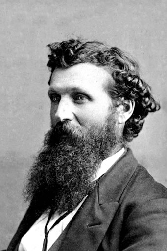

  
```{r setup, include=FALSE}
knitr::opts_chunk$set(warning = FALSE, message = FALSE, 
                      fig.retina = 3, fig.align = "center")
```

# Public Lands & <br> Endangered Species

.pull-left[
<figure>
  
</figure>

]

.pull-right[

**EVSS-PUBA 534: Environmental Law and Regulatory Policy**

**Spring 2022**

.light[Matthew Nowlin, PhD<br>
Department of Political Science<br>
College of Charleston
]

]

---

class: middle 

# Public lands 

---

class: title title-2

# Public Lands 

**What are public lands?** 

--

.pull-left[
Owned and administered by national, state, and local governments

_Federal government owns about 28% of surface land_  

]


.pull-right[
<figure>
  
</figure>
]

---

class: title title-2

# Public Lands 

**The Constitution**  

--

__The Property Clause__: Article IV, Section 3, Clause 2  

> The Congress shall have Power to dispose of and make all needful Rules and Regulations respecting the Territory or other Property belonging to the United States 

---

class: title title-2

# Public Lands 

**The Constitution**  

__The Takings Clause__: Fifth Amendment 

> nor shall private property be taken for public use, without just compensation 
--


_Regulatory takings_  
* _Lucas v. South Carolina Coastal Council_ (1992)
* _all economically beneficial use of land_


---

class: title title-2

# Public Lands 

**Controversies** 

--

* _Preservation_ vs _conservation_ 

???
19th century 
--

* _Market commodities_ vs _spiritual and aesthetic values_; _ecosystem services_

--

* Conflicting economic uses 
  * _Extraction_ vs _tourism_ 

--

* Conflicting management philosophies
  * _Open-access_ vs _rule-based_


---

class: middle 

# Preservationist

---

class: title title-2

# Preservationist

.pull-left[
<figure>
<center>
  
</figure>
]

.pull-right[
.small[_We need the tonic of wildness...At the same time that we are earnest to explore and learn all things, we require that all things be mysterious and unexplorable, that land and sea be indefinitely wild, unsurveyed and unfathomed by us because unfathomable. We can never have enough of nature_

-- Henry David Thoreau, _Walden_, 1854 
]
]


---

class: title title-2

# Preservationist

.pull-left[
</br>
_Man everywhere is a disturbing agent. Wherever he plants his foot, the harmonies of nature are turned to discords_ 

-- George Perkins Marsh, _Man and Nature_, 1864
]

.pull-right[
<figure>
<center>
  
</figure>

]

---

class: title title-2

# Preservationist

.pull-left[
<figure>
<center>
  
</figure>
]

.pull-right[
_In every walk with nature one receives far more than he seeks_

-- John Muir

**Father of the National Parks** 

**Founded the Sierra Club in 1892**

</br>

\* **But, he was pretty racist** 
]

---

class: middle 

# Conservationist 

---

class: title title-2 

# Conservationist

**Conservation**:

> **Limit excesses and encourage both businesses and individuals to use the nation's vast natural resources more carefully through government regulation** 

.tiny[Kline, Benjamin. 2011. First Along the River: A Brief History of the U.S. Environmental Movement. 4th ed. Lanham, MD: Rowman & Littlefield.]

---

class: title title-2

# Conservation

.pull-left[.small[
_Wise forest protection does not mean the withdrawal of forest resources, whether of wood, water, or grass, from contributing their full share to the welfare of the people, but, on the contrary, gives the assurance of larger and more certain supplies. The fundamental idea of forestry is the perpetuation of forests by use. Forest protection is not an end of itself; it is a means to increase and sustain the resources of our country and the industries which depend on them_
]
]

.pull-right[
</br>
<figure>
<center>
  
</figure>
]

---

class: title title-2

# Conservation

.pull-left[
<figure>
<center>
  
</figure>
]

.pull-right[
</br>
_Conservation means the wise use of the earth and its resources for the lasting good of men_

-- Gifford Pinchot

</br>

\* **But, he was also pretty racist** 

]

---

class: title title-2

# Conservation 

**Three Major Tenets** 

--

* Conservation is not the locking up of resources; it is their development and wise use

--

* Conservation is the greatest good, for the greatest number, for the longest time

--

* The federal pubic lands belong to all the people

---

class: title title-2

# Public Lands 

**Homestead Act 1862** 
* Any adult (21) citizen or intended citizen that had not borne arms against the US government could claim 160 acres to settle and cultivate for 5 years

???
__Development Era: 1800-1890__ 
* _Federal land policy was to transfer ownership to the states and private entities_ 
--

**General Mining Act 1872** 
* Title to extract _valuable deposits_ (gold, silver, copper) to whoever found and staked a claim 

---

class: title title-2

# Public Lands 

**US Territory** 

--

Louisiana Purchase (1803)

--

Treaty with Spain (1819): _Florida_  

--

Annexation of Texas (1845)

--

Oregon Treaty (1846): _Washington, Oregon, Idaho, and portions of western Montana_ 

---

class: title title-2

# Public Lands 

**US Territory** 

.pull-left[
End of the Mexican-American War (1848): _California, Nevada, Utah, Arizona, and New Mexico_   

Gadsden Purchase (1853): _Parts of southern Arizona and south-west New Mexico_ 
]

.pull-right[
<figure>
  
</figure>
]

---

class: title title-2

# Public Lands 

**Environmentalism Era: 1962-1980** 

> **National forest and other public land management decisions now required formal planning procedures, including documentation of environmental impacts and alternatives, interagency review, public input, and expanded rights for legal challenges and judicial review** 

.tiny[Andrews, pg 276]

---

class: title title-2

# Public Lands 

**The Land and Water Conservation Fund 1964**
* Authorized funding for federal and state land acquisition for parks, outdoor recreation, and other conservation purposes

--

* Based on fees, but appropriated by Congress 

--

* Expired in 2015, _but_...

---

class: title title-2

# Public Lands 

**The Land and Water Conservation Fund 1964**

**John D. Dingell Jr. Conservation, Management, and Recreation Act 2019**

.pull-left[
* Provides 1.3 million acres of new wilderness 

* Land and Water Conservation Fund made permanent 
]

.pull-right[
<figure>
  
</figure>
]


---

class: title title-2

# Public Lands 
 
**The Wilderness Act 1964** 
* _Preserve_ some of last remaining large areas of wild public land

--

* **Eastern Wilderness Act 1974** 
  * Lands in the east that had recovered to their mostly nature state 

---

class: title title-2

# Public Lands 

**The Endangered Species Act 1973** 

* List endangered or threatened species of plants and animals

--

* Prevents _taking_ of species or destruction of their _critical habitat_ 

---

class: title title-2

# Public Lands 

**Sagebrush Rebellion** 

--

Western states wanted more state and local control of federally owned land for grazing, off-road vehicle use, and other uses

--

.pull-left[
* Ranchers 
* Mining companies 
* Western state governments 
* _Ronald Reagan_
]

???
why western states?
--

.pull-right[
<figure>
  
</figure>
]

---

class: title title-2

# Public Lands 

**Wise-Use Movement** 

???
Name comes from Gifford Pinchot quote 
--

**Grew around opposition to** 
* Reforms in federal grazing policies
* “Conservation use” permits
* Reform of the General Mining Act of 1872
* Tougher regulation of pollution from mining

--

.small[**... _a coalition of grass-roots and corporate interests bound together by antigovernment ideology, property-rights arguments, and hostility to federal environmental regulations_**]

---

class: title title-2

# Public Lands 

<figure>
<center>
  
</figure>

---

class: title title-2

# Forest Service 

**Department of Agriculture**

[Forest Service website](https://www.fs.usda.gov/)

.pull-left[
__Mission__: _Sustain the health, diversity, and productivity of the nation’s forests and grasslands to meet the needs of present and future generations_ 
]

.pull-right[
<figure>
<center>
  
</figure>
]

---

class: title title-2

# Forest Service 

**Department of Agriculture**

**Manages** 
* 193 million acres across 43 states 
* 154 national forests and 20 grasslands 

--

**National Forest Management Act 1976** 
* Develop comprehensive plans for the management of national forests
    

---

class: title title-2

# Forest Service 

**Multiple-Use Management** 
* Major focus on timber and logging 

--

**Ecosystem Management**
* "Adaptive management" and ecological sustainability 
* Obama Administration rule (2012)
  * Forest restoration 
  * Adaptation to climate change
  * Strengthened public input

---

class: title title-2

# Forest Service 

**Fire Management**

.pull-left[
* Longer fire seasons
* Bigger fires: more acres burned 
* Exacerbated by climate change 
* _Prescribed fire_ 
]

.pull-right[
<figure>
  
</figure>
]

---

class: title title-2

# Forest Service 

**Fire Management**

.pull-left[
* Longer fire seasons
* Bigger fires: more acres burned 
* Exacerbated by climate change 
* _Prescribed fire_ 
]

.pull-right[
<figure>
  
</figure>
]


---

class: title title-2

# National Park Service 

**Department of the Interior** 

[National Park Service website](https://www.nps.gov/index.htm)

.pull-left[
__Mission__: _Preserves unimpaired the natural and cultural resources and values of the National Park System for the enjoyment, education, and inspiration of this and future generations_ 
]

.pull-right[
<figure>
  
</figure>
]

---

class: title title-2

# National Park Service 

**Manages**
* 400 sites 
* 59 national parks 
* 89 national monuments 
* Historic sites (Fort Sumter)

--

**Preservation vs Mass Recreation** 
* 15 percent of funding comes from fees, franchises, donations, and other sources 

---

class: title title-2

# Fish and Wildlife Service

**Department of the Interior** 

.pull-left[
__Mission__: _Work with others to conserve, protect and enhance fish, wildlife and plants and their habitats for the continuing benefit of the American people_ 
]

.pull-right[
<figure>
  
</figure>
]

---

class: title title-2

# Fish and Wildlife Service

**Endangered Species** 

--

* Identifies and lists endangered or threatened species
  * 1600 US species, and 600 foreign species

--

* **National Wildlife Refuge System**
  * 560 refuges, 38 wetland management districts 
  * 150 millions acres of land and water 

---

class: title title-2

# Bureau of Land Management 

**Department of the Interior**

[Bureau of Land Management website](https://www.blm.gov/)

.pull-left[
__Mission__: _To sustain the health, diversity, and productivity of the public lands for the use and enjoyment of present and future generations_ 
]

.pull-right[
<figure>
<center>
  
</figure>
]

---

class: title title-2

# Bureau of Land Management 

.pull-left[
**Created in 1946 by combining**:
* General Land Office (1812)
* Grazing Service (Taylor Grazing Act 1934)

**Manages**
* 256 million acres
* 99.9 percent in 12 Western states, including Alaska 
]

.pull-right[
<figure>
  
</figure>
]

---

class: title title-2

# Bureau of Land Management 

**Federal Land Policy and Management Act 1976**
* National System of Public Lands 
* Comprehensive long-range planning 
* Grazing fees 

--

**Stakeholders** 
.pull-left[
* Ranchers 
* Mining interests 
* Native American tribes
]
.pull-right[
* Environmentalists 
* Outdoor recreation  
]

---

class: title title-2

# Bureau of Land Management 

**Coal, Oil, and Gas Leasing** 

.pull-left[
**Mineral Leasing Act 1920** 

**Surface Mining Control and Reclamation Act 1977**

_Arctic National Wildlife Refuge_ 

(Small) fossil fuel subsidy 

]

.pull-right[
<figure>
  
</figure>
]

---

class: title title-2

# Ocean Conservation 

_Manages the areas of the ocean under US jurisdiction, and their fisheries, minerals, ecosystems, and other resources_ 

--

**National Oceanic and Atmospheric Administration (NOAA)** 
* Created in 1970
* Combined the Bureau of Commercial Fisheries, the Weather Bureau, and the US Coast and Geodetic Survey 
* _the principal agency for scientific monitoring of atmospheric and ocean conditions and for management of US ocean fisheries_ 

---

class: title title-2

# Ocean Conservation 

**Fisheries Conservation and Management Act 1976** 
* The _Magnuson-Stevens Act_ 
* Sustainable management of commercial fisheries

--

**Sustainable Fisheries Act 1996** 
* Required management plans include criteria to limit overfishing 
* **2007**: _catch share programs_ including individual fishing quotas and limited-access privileges

---

class: title title-2

# Ocean Conservation 

**The National Marine Sanctuaries Act 1972** 
* Designate and manage marine areas of importance 
* _Marine Protected Areas_, ~1000

--

**Coastal Zone Management Act 1972** 
* Promote active planning and management of coastal areas 

--

**Restrict activities that directly impact the living resources of the ocean** 

---

class: middle 

# Endangered species 

---

<figure>
<center>
  
</figure>

---

class: middle 

# Why should we be concerned about endangered species? 

???
Humans are responsible for a large wave of extinctions as a result of _habitat degradation, introduction of exotic species, and overhunting (@salzmanEnvironmentalLawPolicy2014)
---

class: title title-2

# Biodiversity 

> **The variability among living organisms from all sources, including terrestrial, marine, and other aquatic ecosystems and the ecological complexes of which they are apart; this includes diversity within species, between species, and of ecosystems** 

.small[_The International Convention on Biological Diversity, signed at the Rio Earth Summit in 1992_]

---

class: title title-2

# Endangered Species Act 

**Passed in 1973** 

**What does it do?** 

--

* List endangered or threatened species of plants and animals
* Prevents _taking_ of species or destruction of their _critical habitat_ 

--

**Implementation of ESA**  
* [The Fish and Wildlife Service](https://www.fws.gov/) within the Department of Interior 
* [NOAA Fisheries](https://www.fisheries.noaa.gov/) within the Department of Commerce 

---

class: title title-2

# Endangered Species Act 

**Section 2. Findings, Purposes, and Policy** 

(b) PURPOSES.—The purposes of this Act are to provide a means whereby the ecosystems upon which **endangered species** and **threatened species** depend may be conserved, to provide a program for the conservation of such endangered species and threatened species, and to take such steps as may be appropriate to achieve the purposes of the treaties and conventions set forth in subsection (a) of this section.

---

class: title title-2

# Endangered Species Act 

**Section 3: Definitions** 

(6) The term "**endangered species**" means any species which is in danger of extinction throughout all or a significant portion of its range other than a species of the Class Insecta determined by the Secretary to constitute a pest whose protection under the provisions of this Act would present an overwhelming and overriding risk to man.

---

class: title title-2

# Endangered Species Act 

**Section 3: Definitions** 

(20) The term "**threatened species**" means any species which is likely to become an endangered species within the foreseeable future throughout all or a significant portion of its range.

---

class: title title-2

# Endangered Species Act 

**Section 3: Definitions** 

(5)(A) The term "critical habitat" for a threatened or endangered species means—

* (i) _specific areas within the geographical area occupied by the species_ 
  * (I) _essential to the conservation of the species_ 
  * (II) _which may require special management considerations or protection_ 

---

class: title title-2

# Endangered Species Act 

**Section 3: Definitions** 

(5)(A) The term "critical habitat" for a threatened or endangered species means—

* (ii) _specific areas outside the geographical area occupied by the species ... upon a determination by the Secretary that such areas are essential for the conservation of the species_ 

* (C) _Except in those circumstances determined by the Secretary, critical habitat shall not include the entire geographical area which can be occupied by the threatened or endangered species._ 

---

class: title title-2

# Endangered Species Act 

**Section 4. Determination of Endangered Species and Threatened Species** 

(a) requires the Secretary to determine whether any species is _endangered_ or _threatened_ and to designate _critical habits_ of such species

--

(b) provides that the listing determination be based _solely on the basis of the best scientific and commercial data available_ and critical habitat designation is to be _on the basis of the best scientific data available and after taking into consideration the economic impact, the impact on national security, and any other relevant impact_

---

class: title title-2

# Endangered Species Act 

**Section 4. Determination of Endangered Species and Threatened Species** 

(b)(3) provides that citizens may petition to force listing determination 

--

(c) requires the Secretary to publish in the Federal Register a list of all endangered and threatened species and to review the list every five years to determine whether any species should be removed from the list or changed in status.

---

class: title title-2

# Endangered Species Act 

**Section 4. Determination of Endangered Species and Threatened Species** 

(d) requires the Secretary to issue _such regulations as he deems necessary and advisable to provide for the conservation_ of species listed as threatened, including prohibiting any acts prohibited under section 9 for endangered species of fish, wildlife, or plants.

--

(f) requires the Secretary to develop and implement recovery plans for endangered and threatened species unless he finds they will not promote conservation of the species.

---

class: title title-2

# Endangered Species Act 

**Section 7: Review of Federal Actions**

(a)(1) requires all federal agencies to carry out programs to conserve endangered and threatened species.

--

(a)(2) provides that all federal agencies must insure ... that their actions are _not likely to jeopardize the continued existence of any endangered species or threatened species or result in the destruction or adverse modification_" of such species' critical habitat.

---

class: title title-2

# Endangered Species Act 

**Section 9: Prohibitions**  

(a) prohibits sale, import, export, or transport of any species listed as endangered.

--

(a)(1)(B) & (C) make it unlawful to _take_ (broadly defined by section 3(19) to cover harassing, harming, killing, capturing, or collecting) any endangered animal species.

--

(a)(2)(B) prohibits removal or damage of endangered plants on federal lands or anywhere else if in knowing violation of state law.

---

class: title title-2

# Endangered Species Act

**1978 Amendments** 

Created the The Endangered Species Committee (aka "The God Squad") that has the authority to grant exemption from Section 7 requirements 

**Includes** 
.pull-left[
* EPA Administrator 
* NOAA Administrator 
* CEA chairman 
* Representative from the state 
]

.pull-right[
* Secretary of Agriculture 
* Secretary of the Army 
* Secretary of the Interior 
]

???
5 of 7 have to vote yes to grant exemption 
---

class: title title-2

# Endangered Species Act

**Controversies** 

* The ESA does not effectively address the problem of exotic species 

--

* The ESA provides no protection until species is in danger of extinction 
	* _Emergency room_ approach to biodiversity 

---

class: title title-2

# Endangered Species Act

**Controversies** 

* Goes too far? 
	* Restricts new land development 
	* Reduced the amount of water that farmers can divert 
	* Constrains infrastructure development and use of natural resources 

--

* The balance of benefits and costs are not taken into account 

--

* _Charismatic megafauna_


---

class: title title-2

# For Next Time 

**The National Environmental Policy Act** 

* _Readings_:
  - [Summary of the National Environmental Policy Act](https://www.epa.gov/laws-regulations/summary-national-environmental-policy-act)
  - **Salzman and Thompson**, Chapter 12: _The National Environmental Policy Act_. 
  - Scott, Tyler Andrew, Nicola Ulibarri, and Omar Perez Figueroa. 2020. “NEPA and National Trends in Federal Infrastructure Siting in the United States.” _Review of Policy Research_ 37(5): 605–33.


---

class: title title-2

# In-Class Assignment 

**Case studies** 

* Group 1: Describe a _National Park_ 

* Group 2: Describe the Cliven Bundy controversy 

* Group 3: Describe a species listed as endangered 


