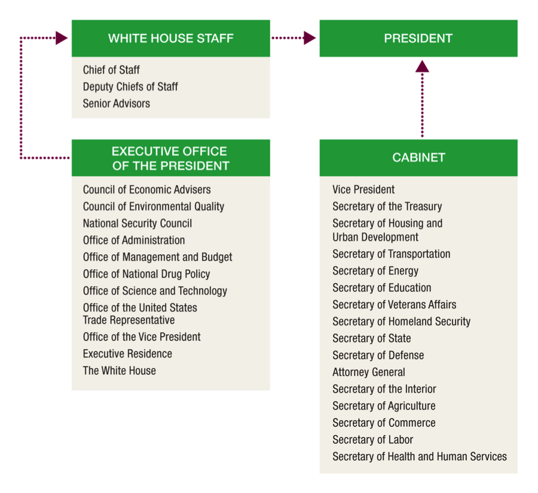

  
```{r setup, include=FALSE}
knitr::opts_chunk$set(warning = FALSE, message = FALSE, 
                      fig.retina = 3, fig.align = "center")
```

# The National Environmental Policy Act

.pull-left[
<figure>
  
</figure>

]

.pull-right[

**EVSS-PUBA 534: Environmental Law and Regulatory Policy**

**Spring 2022**

.light[Matthew Nowlin, PhD<br>
Department of Political Science<br>
College of Charleston
]

]

---

class: middle 

# Talk to me about your papers and presentations 

---

class: middle 

# In-Class Assignment 10: Course evaluations! 

---

class: middle 

# Any thoughts on the course you would like to share? 

---

class: middle 

# The National Environmental Policy Act (NEPA)

---

class: title title-2

# NEPA 

**Passed by Congress in 1969 and signed by President Nixon on Janurary 1, 1970** 
--


**_The Environmental Decade_** 

--

[EPA: NEPA Website](https://www.epa.gov/nepa)

[CEQ: NEPA Website](https://ceq.doe.gov/)

[NEPA: Full Text](https://www.energy.gov/sites/default/files/nepapub/nepa_documents/RedDont/Req-NEPA.pdf)

---

class: title title-2

# NEPA 

**Purpose**   

The purposes of this Act are _to declare a national policy which will encourage productive and enjoyable harmony between man and his environment; to promote efforts which will prevent or eliminate damage to the environment and biosphere and stimulate the health and welfare of man; to enrich the understanding of the ecological systems and natural resources important to the Nation; and to establish a Council on Environmental Quality_

---

class: title title-2

# NEPA 

* Examines proposed actions that fall under federal jurisdiction to ensure stakeholder participation

--

* Created the Council of Environmental Quality to advise the president
  * [Council of Environmental Quality website](https://www.whitehouse.gov/ceq/)


---

class: title title-2

# NEPA 

**Section 101: Congressional declaration of national environmental policy** 

* Establishes as the _continuing policy of the Federal Government to use practicable means and measures ... to create and maintain conditions under which man and nature can exist in productive harmony, and fulfill the social, economic, and other requirements of present and future generations of Americans_

---

class: title title-2

# NEPA 

**Section 102: Cooperation of agencies; reports; availability of information; recommendations; international and national coordination of efforts** 

* (2)(C) Requires all federal agencies to prepare a **detailed statement** on major federal actions significantly affecting the quality of the environment 

---

class: title title-2

# NEPA 

.small[
(C) include in every recommendation or report on proposals for legislation and other major Federal actions significantly affecting the quality of the human environment, a detailed statement by the responsible official on --

(i) the environmental impact of the proposed action, 

(ii) any adverse environmental effects which cannot be avoided should the proposal be implemented, 

(iii) alternatives to the proposed action,

(iv) the relationship between local short-term uses of man's environment and the maintenance and enhancement of long-term productivity, and 

(v) any irreversible and irretrievable commitments of resources which would be involved in the proposed action should it be implemented.
]

---

class: title title-2

# NEPA 

**Title II: Council on Environmental Quality** 

**Section 202: Establishment; membership; chairman; appointments** 

.pull-left[
* Establishes a three-member Council on Environmental Quality (CEQ) in the Executive Office of the President 
]

.pull-right[
<figure>
<center>
  
</figure>
]

---

class: title title-2

# NEPA 

**Title II: Council on Environmental Quality** 

**Section 204: Duties and functions** 

* Outlines duties and functions of CEQ including ~~annual reporting on the condition of the environment~~, information gathering, and review and appraisal of federal programs and activities 

---

class: title title-2

# NEPA 

**_Calvert Cliffs' Coordinating Committee, Inc v. United States Atomic Energy Commission_** 

**Decided by the DC Circuit in 1971** 

--
* Baltimore Gas and Electric purchased property in Calvert County, Maryland to build a nuclear power plant and construction began in 1968

--
* AEC changed its licensing rules in 1970 to comply with NEPA
	* Utilities must submit an environmental report, but the AEC was not obligated to consider environmental impacts 
	
???
unless an objection was raised 

---

class: title title-2

# NEPA 

**_Calvert Cliffs' Coordinating Committee, Inc v. United States Atomic Energy Commission_** 

* Environmental groups formed the Calvert Cliffs' Coordinating Committee to opposed the plant and challenged the AEC rules 

--

* The DC Circuit found that: 
  * Section 102 requirements are not flexible 
  * Every federal agency and department is required to consider environmental protection and "_to take environmental values into account_ "

---

class: title title-2 

# The NEPA Process 

**Threshold questions**: 

* Major federal action? 

* Are the environmental impacts significant? 

--

Based on [Council of Environmental Quality regulations developed in 1978](https://ceq.doe.gov/docs/laws-regulations/FR-1978-11-29-43-FR-55978-CEQ-NEPA-Regulations-NOFR.pdf) 

---

class: title title-2 

# The NEPA Process 

<figure>
<center>
  
</figure>


---

class: title title-2 

# The NEPA Process 

<figure>
<center>
  
</figure>


---

class: title title-2 

# The NEPA Process 

**Major actions** 

* Does this constitute a major action? 

--

* Agencies can't segment or divide up projects 

--

* Also includes private projects that are "entirely or partly financed, assisted, conducted, regulated, or approved by federal agencies"

---

class: title title-2 

# The NEPA Process 

**Major actions** 

CEQ guidelines:
* Adoption of official policy such as rules, regulations, and interpretations

--
* Adoption of formal plans which guide alternative uses of federal resources 

--
* Adoption of programs to implement policy

--
* Approval of specific projects such as construction or management activities located in a defined geographic area  


---

class: title title-2 

# The NEPA Process 

**Significantly affecting the human environment** 
* Does the proposed action significantly impact the environment? 
* Consider "context" and "intensity" 

--

**Categorical exclusions** 
* _A category of actions which do not individually or cumulatively have a significant effect on the human environment_ 

---

class: title title-2 

# The NEPA Process 

<figure>
<center>
  
</figure>

---

class: title title-2 

# The NEPA Process 

**Environmental Assessment (EA)** 

The EA is intended to be a concise document that:  
* (1) briefly provides sufficient evidence and analysis for determining whether to prepare an EIS;

--
* (2) aids an agency’s compliance with NEPA when no environmental impact statement is necessary; and

--
* (3) facilitates preparation of an Environmental Impact Statement when one is necessary.

---

class: title title-2 

# The NEPA Process 

**Environmental Impact Statements (EIS)** 

* Notice of Intent and Scoping
  * Identify people or organizations who are interested in the proposed action;
	* Identify the significant issues to be analyzed in the EIS; 
	* Determine the roles and responsibilities of lead and cooperating agencies; 
	* Identify gaps in data and informational needs; 
	* Set time limits for the process and page limits for the EIS

---

class: title title-2 

# The NEPA Process 

**Environmental Impact Statements (EIS)** 

.pull-left[
* Draft EIS

* _Comment period_ 

* Final EIS
]


.pull-right[
<figure>
<center>
  
</figure>
]

---

class: title title-2 

# The NEPA Process 

**Environmental Impact Statements (EIS)**  

.pull-left[
* Proposal and need statement
* Alternatives
* Affected environment 
* Environmental consequences 
* List of preparers 
* Appendix 
]

.pull-right[
<figure>
  
</figure>
]

---

class: title title-2 

# The NEPA Process 

**Overseen by**: 

* CEQ 

* EPA
  * EPA's Office of Federal Activities, within the [Office of Policy](https://www.epa.gov/aboutepa/about-office-policy-op), is the official recipient of all EISs prepared by federal agencies

* [U.S. Institute for Environmental Conflict Resolution](https://www.udall.gov/ourprograms/institute/institute.aspx)

---

class: title title-2 

# The NEPA Process 

**The Role of the EPA**  

_Outlined in section 309 of the Clean Air Act (1970)_ 

* EPA rates: the _adequacy_ of the EIS
	* Adequate 
	* Needs more information 
	* Inadequate 

---

class: title title-2 

# The NEPA Process 

**The Role of the EPA**  

_Outlined in section 309 of the Clean Air Act (1970)_ 

* EPA rates: the _environmental impact_ of the action  
	* Lack of objections 
	* Environmental concerns 
	* Environmental objections 
	* Environmentally unsatisfactory 

---

class: middle 

# What Types of Communities Are Affected by Federal Infrastructure? 

---

class: title title-2

# NEPA and Infrastructure

<figure>
<center>
  
</figure>

???
Built: "airport expansion"; "channel dredging"

Institutional: "resource management plan"
---

class: middle 

# Revisiting themes 

---

class: title title-2 

# Challenges and Themes 

.pull-left[
* **Complexity** 
* **Scientific uncertainty**
* **Dynamism**
* **Precaution** 
* **Market failures** 
* **Property rights** 
* **Mismatched scales** 
]
 
.pull-right[
* **Risk** 
* **Risk assessment**
* **Enforcement** 
* **Four analytical frameworks** 
  * Environmental rights 
  * Sustainable development 
  * Utilitarianism and cost-benefit analysis 
  * Environmental justice 
]

---

class:middle 

# Next time: Presentations!!! 


